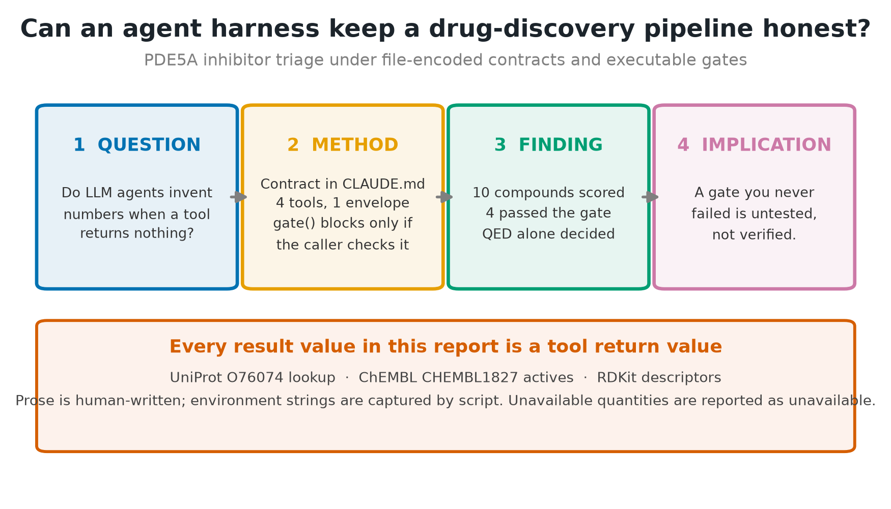
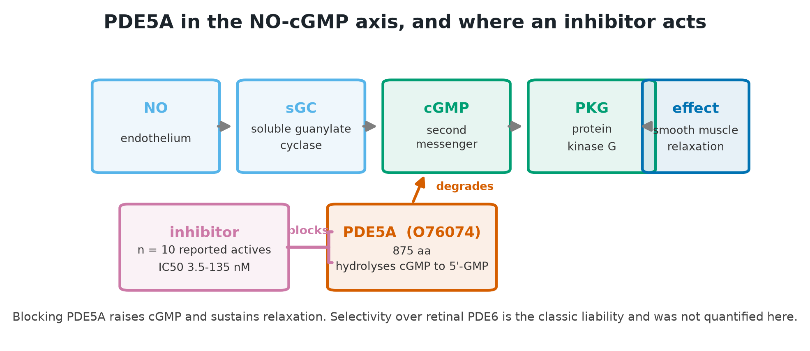
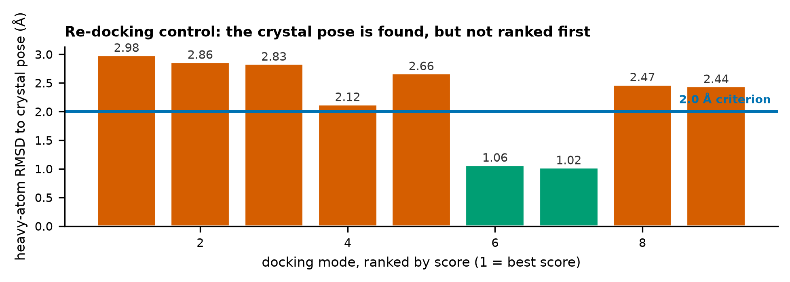
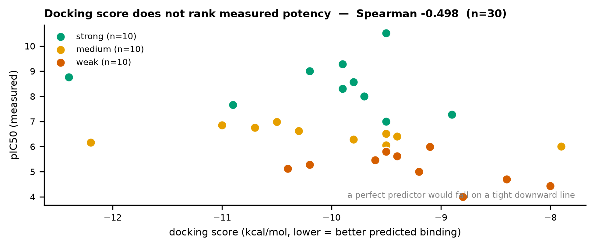
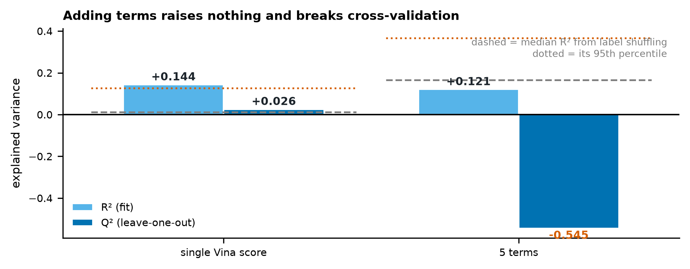
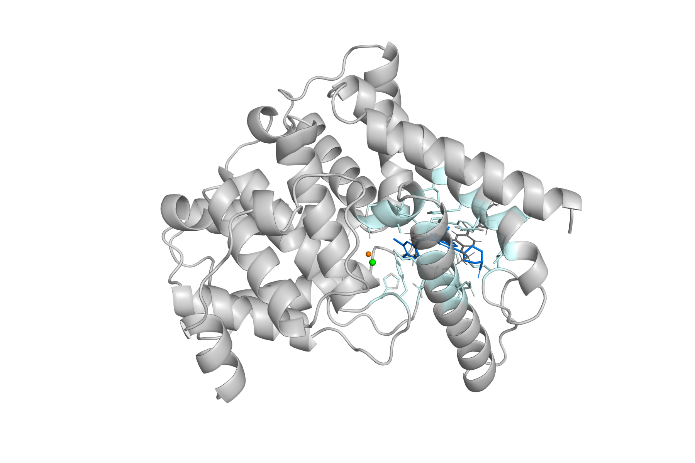
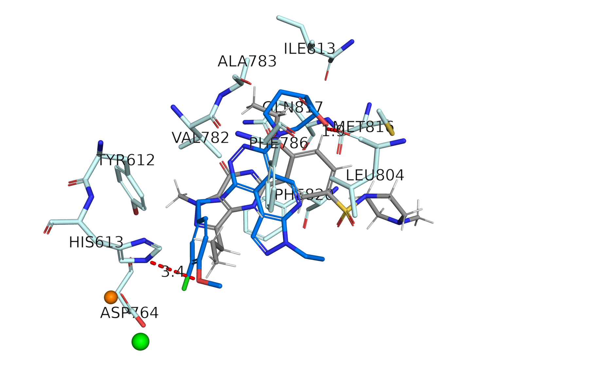
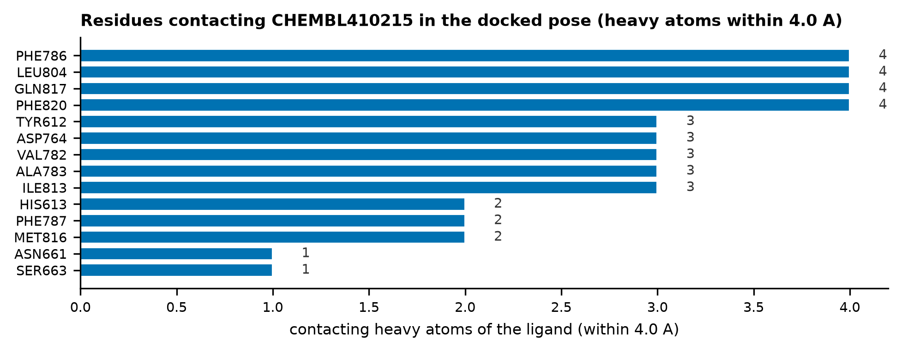

> **이 보고서는 v3.0 `report_controlled.md` 로 대체되었다.** 여기 실린 선별 성능
> (ROC-AUC 0.765 / 0.775) 은 역가와 골격 유사성이
> 분리되지 않은 표본에서 나온 값이라 해석할 수 없다. 강함 층은 공결정 리간드와 골격을
> 공유하는 실데나필 유사체가 주도했고 수용체는 그 리간드의 holo 구조였다. 골격을 통제한
> 재설계 결과는 `sample_run/report/report_controlled.md` 를 보라. 이 문서는 감사 추적을
> 위해 보존한다.

# 도킹 점수는 PDE5A 저해제를 선별하는가, 정량하는가
## 우선순위 지표와 정량 예측을 분리한 결정 구조 기반 평가

**작성일** 2026-09-05 · **버전** 1.0 · **원자료** `sample_run/` (dataset30 `7f8e1038cb919322`,
docking `fc9d699be0a187c8`, regression `b730f022dae347dc`)

**Graphical abstract.**

---

## 초록

**배경.** 구조 기반 가상 스크리닝은 도킹 점수로 화합물의 우선순위를 정한다. 그러나 점수가
실측 역가를 얼마나 반영하는지는 표적과 계열마다 다르다.

**방법.** PDE5A 결정 구조(PDB 1UDT,
공결정 리간드 VIA)에 ChEMBL 30건을 도킹했다. 화합물은
역가로 층화해 뽑았다 (강함 10 · 중간 10 · 약함 10,
pIC50 4.00–10.52). 공결정 리간드 재도킹을 대조로 두고, 점수를 구성하는
5개 항으로 pIC50 회귀를 적합해 단일 점수와 비교했다.

**결과.** 재도킹 대조에서 **샘플링은 결정 자세를 재현했으나
(1.02 Å) 채점 함수는 그 자세를 1위로 올리지 못했다
(2.984 Å).** 두 질문의 답이 갈렸다. **순위 분리는 작동했다** —
순위상관은 선택 자세 -0.474
(95% CI -0.713–-0.137, 순열
p=0.0102), 1위 자세 -0.538
(p=0.0034) 였고, 강함/약함 판별 ROC-AUC 는
0.765 / 0.775 였다. 1위 자세 점수 상위 10건의
층 구성은 강함 5 · 중간 5 ·
약함 0 이다. **정량 예측은 작동하지 않았다** — 단일 점수 회귀의
교차검증 Q² 는 +0.026, 항 회귀는 -0.545 로 음수였다.

**결론.** 도킹 점수는 이 집합에서 **선별에는 쓸 수 있고 정량에는 쓸 수 없다.** 전역 상관과
R² 만 보면 두 결론이 뭉개진다. 항 재가중은 개선을 주지 못했고 교차검증 기준으로 악화되었다.

---

## 1. 서론

구조 기반 가상 스크리닝은 표적 단백질의 결합 부위에 화합물을 계산으로 끼워 넣고, 그때
얻어지는 점수로 우선순위를 정한다. 이 접근이 성립하려면 두 가지가 따로 참이어야 한다.
첫째 **자세 예측** — 프로그램이 실제 결합 자세를 만들어낼 수 있어야 한다. 둘째 **채점** —
그 자세에 매기는 점수가 실측 친화도와 같은 방향으로 움직여야 한다. 두 조건은 독립이며,
전자가 성립해도 후자는 실패할 수 있다.

PDE5A 는 이 질문을 던지기에 좋은 표적이다. 결정 구조가 여러 개 공개되어 있고, 결합 부위가
잘 정의되어 있으며, ChEMBL 에 폭넓은 역가 범위의 실측 활성 데이터가 축적되어 있다.

본 보고는 세 가지를 묻는다. 첫째, 도킹 점수가 실측 역가를 **정량 예측**하는가 —
교차검증 Q² 로 판정한다. 둘째, 점수가 활성 화합물을 **선별**하는가 — 순위상관·ROC-AUC·
농축계수로 판정한다. 셋째, 점수를 항으로 분해해 다시 가중하면 개선되는가.

**앞의 두 질문은 다른 질문이고 답도 다를 수 있다.** 실무에서 도킹은 "상위 N 건만 합성할 때
헛수고를 줄이는가"로 쓰이지 개별 IC50 을 맞히는 데 쓰이지 않는다. 그런데 도킹 평가 문헌은
전역 상관 하나로 두 질문에 동시에 답하려는 경향이 있다. 본 보고는 두 지표군을 분리해 보고한다.

**사전 성공 기준.** 정량 예측은 Q² ≥ 0.3 을 성공으로 본다 (QSAR 관행). 선별은 순열 검정
p < 0.05 이면서 ROC-AUC ≥ 0.7 을 성공으로 본다. 이 기준은 분석 전에 정한 것이 아니라
결과를 본 뒤 문헌 관행에서 가져온 것이며, 그 사실을 §2.5 에 고지한다.

## 2. 방법

### 2.1 표적과 구조

**Figure 1. 표적 맥락.** PDE5A 가 cGMP 를 분해하고 저해제가 이를 막는다.
UniProt O76074 (PDE5A, 875 잔기). 수용체는 PDB
1UDT 이며 공결정 리간드는
VIA 다.

### 2.2 화합물 선정

target=CHEMBL1827; type in (IC50,Ki); relation='='; pchembl not null; 층화 ['strong', 'medium', 'weak'] 각 10건; 정렬 후 균등 간격 선택

표본틀은 다음 규칙으로 만들었다. ChEMBL 활성 질의(`standard_type ∈ {IC50, Ki}`,
`standard_relation = "="`, pChEMBL 존재)를 역가 층별로 던지고, **각 층에서 API 가 돌려준
선착순 400건에서 끊었다.** 세 층 모두 이 상한에 걸렸으므로 표본틀은 문서화되지 않은 API
반환 순서에 의존한다. 화합물당 **첫 레코드만 남기고** 반복 측정은 버렸다 — 어세이 잡음을
중앙값으로 완화할 기회를 쓰지 않았다. 그렇게 정리한 목록을 pChEMBL 로 정렬한 뒤 균등
간격으로 층당 10건씩 집었다 (결정적 규칙이라 시드가 없다).

**IC50 과 Ki 를 함께 받았다.** 30건 중 1건(CHEMBL136498)이 Ki 다. 서로 다른 물리량을
Cheng-Prusoff 보정 없이 단일 y 로 묶었으므로 한계 4 에서 다시 다룬다.

### 2.3 도킹과 대조

**도구.** Smina Oct 15 2019.  Based on AutoDock Vina 1.1.2. · Open Babel 3.1.0 -- Oct 12 2020 -- 14:16:24 ·
PyMOL 2.5.1.

**수용체 준비.** PDB 1UDT 에서 물(all HOH)을 제거하고
촉매 금속 ZN, MG 은 남겼다. 공결정 리간드
VIA 를 분리해 박스 기준으로 썼다. PDBQT 변환은
`obabel -ipdb -opdbqt -xr -p 7.4 (수용체 전용)` — **프로토네이션은 수용체에만 적용했다.**

**리간드 준비.** RDKit ETKDG, 단일 배좌, Chem.AddHs (중성 형태).
리간드에는 pH 기반 프로토네이션을 적용하지 않았다. 탈염: 명시적 단계 없음 — obabel/smina 가 최대 프래그먼트만 도킹함을 산출물에서 확인.

**도킹.** smina (AutoDock Vina 1.1.2 scoring), exhaustiveness 16,
seed 42, `--num_modes 9`, `--autobox_add 3`.

**자세 선택.** reference-guided: 상위 모드 중 공결정 리간드와의 MCS-RMSD 가 최소인 자세. C2 채점 대조가 실패했으므로 점수 1위를 쓰지 않는다. 이 규칙은 공결정 리간드와의
최대공통부분구조 RMSD 를 최소화하는 모드를 고른다. **§3.6 에서 보이듯 이 규칙은 층마다
다르게 작동하며, 그 자체가 교란 요인이다.** 따라서 모든 주요 결과를 선택 자세와 1위 자세
두 가지로 병기한다.

### 2.4 회귀
항 gauss1, gauss2, repulsion, hydrophobic, hbond. n=30, 파라미터 6개.
LOO 교차검증과 라벨 섞기 200회(시드 42)를 함께 보고한다.
순위상관은 **동점 보정 Spearman**(평균 순위, 순위에 대한 Pearson)으로 계산한다.
도킹 점수에는 동점이 많아 단순 정렬 순위를 쓰면 값이 달라진다.

### 2.5 사후성 고지

이 연구에는 **사전등록이 없다.** 결과를 본 뒤에 정해진 결정이 최소 세 가지 있다.

1. **자세 선택 규칙.** C2 채점 대조가 실패한 것을 확인한 뒤 "1위 자세를 쓰지 않는다"로
   정했다. 사전에 정한 규칙이 아니다.
2. **게이트 정의.** C2 를 실행 차단 조건이 아니라 해석 제약으로 격하한 것도 사후 결정이다.
3. **성공 기준.** §1 의 Q² ≥ 0.3, AUC ≥ 0.7 은 결과를 본 뒤 문헌 관행에서 가져왔다.

세 결정 모두 결과 해석에 유리한 방향으로 작동했을 수 있다. 이를 상쇄하기 위해 선택 자세와
1위 자세 결과를 전부 병기했으며, 두 값의 차이가 결론을 바꾸지 않음을 §3.3 에서 보인다.

## 3. 결과

### 3.1 대조

| 항목 | 값 | 판정 |
|---|---|---|
| 재도킹 점수 | -9.6 kcal/mol | — |
| C1 샘플링 (상위 모드 최선 RMSD) | 1.02 Å | PASS |
| C2 채점 (1위 자세 RMSD) | 2.984 Å | FAIL |

**Table 1. 재도킹 대조.** 기준 2.0 Å.

**Figure 2. 모드별 결정 자세 재현도.** 막대는 각 도킹 모드의 결정 자세 대비 RMSD 이며
가로축은 점수 순위다. 기준을 만족하는 자세가 존재하지만 1위가 아니다.

### 3.2 도킹 결과

| ChEMBL ID | 층 | IC50/Ki (nM) | pIC50 | 선택 자세 점수 | 1위 자세 점수 | 모드 | MCS-RMSD (Å) |
|---|---|---|---|---|---|---|---|
| CHEMBL410215 | strong | 0.03 | 10.52 | -9.50 | -11.40 | 8 | 3.599 |
| CHEMBL553075 | strong | 0.53 | 9.28 | -9.90 | -10.30 | 5 | 2.675 |
| CHEMBL361582 | strong | 1 | 9.00 | -10.20 | -10.60 | 3 | 1.798 |
| CHEMBL136498 | strong | 1.74 | 8.76 | -12.40 | -13.70 | 2 | 2.475 |
| CHEMBL544310 | strong | 2.7 | 8.57 | -9.80 | -10.20 | 2 | 3.106 |
| CHEMBL434135 | strong | 5 | 8.30 | -9.90 | -10.40 | 3 | 1.124 |
| CHEMBL183150 | strong | 10 | 8.00 | -9.70 | -10.70 | 7 | 1.643 |
| CHEMBL370241 | strong | 22 | 7.66 | -10.90 | -10.90 | 1 | 2.272 |
| CHEMBL115152 | strong | 54 | 7.27 | -8.90 | -9.30 | 4 | 3.164 |
| CHEMBL86602 | strong | 100 | 7.00 | -9.50 | -9.50 | 2 | 1.412 |
| CHEMBL2180661 | medium | 104 | 6.98 | -10.50 | -10.50 | 1 | 1.205 |
| CHEMBL5871683 | medium | 140 | 6.85 | -11.00 | -11.10 | 3 | 2.944 |
| CHEMBL371451 | medium | 180 | 6.75 | -10.70 | -12.10 | 5 | 3.86 |
| CHEMBL4278092 | medium | 240 | 6.62 | -10.30 | -10.40 | 3 | 2.389 |
| CHEMBL2180662 | medium | 312 | 6.51 | -9.50 | -10.00 | 6 | 1.416 |
| CHEMBL70837 | medium | 400 | 6.40 | -9.40 | -10.10 | 6 | 3.233 |
| CHEMBL361481 | medium | 520 | 6.28 | -9.80 | -10.50 | 5 | 3.232 |
| CHEMBL3703685 | medium | 690 | 6.16 | -12.20 | -12.50 | 7 | 1.635 |
| CHEMBL4788965 | medium | 900 | 6.05 | -9.50 | -9.80 | 7 | 3.452 |
| CHEMBL42713 | medium | 1e+03 | 6.00 | -7.90 | -8.40 | 5 | 0.343 |
| CHEMBL190773 | weak | 1.03e+03 | 5.99 | -9.10 | -9.90 | 8 | 3.627 |
| CHEMBL63416 | weak | 1.6e+03 | 5.80 | -9.50 | -9.50 | 1 | None |
| CHEMBL119506 | weak | 2.4e+03 | 5.62 | -9.40 | -9.80 | 4 | 2.26 |
| CHEMBL187632 | weak | 3.5e+03 | 5.46 | -9.60 | -10.30 | 7 | 3.744 |
| CHEMBL1778033 | weak | 5.2e+03 | 5.28 | -10.20 | -10.40 | 3 | 2.403 |
| CHEMBL263311 | weak | 7.56e+03 | 5.12 | -10.40 | -10.40 | 2 | 4.493 |
| CHEMBL189772 | weak | 1e+04 | 5.00 | -9.20 | -9.70 | 4 | 3.955 |
| CHEMBL313143 | weak | 2e+04 | 4.70 | -8.40 | -9.00 | 9 | 3.42 |
| CHEMBL142922 | weak | 3.7e+04 | 4.43 | -8.00 | -9.30 | 9 | 3.274 |
| CHEMBL92043 | weak | 1e+05 | 4.00 | -8.80 | -9.60 | 6 | 1.655 |

**Table 2. 도킹 결과 30건.** CHEMBL136498 은 Ki 이고 나머지는 IC50 이다.
MCS-RMSD 가 비어 있는 행(CHEMBL63416)은 공결정 리간드와의 최대공통부분구조가 8원자 하한에
미달해 참조 기준 선택이 불가능했고, **점수 1위 자세로 폴백했다.**

### 3.3 점수와 역가의 관계

| 자세 | Spearman | 95% CI | 순열 p | ROC-AUC (강 vs 약) | AUC 순열 p | EF (상위 10/20) |
|---|---|---|---|---|---|---|
| 선택 자세 | -0.474 | -0.713–-0.137 | 0.0102 | 0.765 | 0.0457 | 1.4 |
| 1위 자세 | -0.538 | -0.752–-0.220 | 0.0034 | 0.775 | 0.0366 | 1.4 |

**Table 3. 순위 분리 지표.** tie-corrected Spearman (average ranks, Pearson on ranks). 순열 p 는 라벨을 10000회
섞어(시드 42) 얻은 양측 값이다. 점수는 낮을수록, pIC50 은 높을수록 좋으므로
음의 상관이 양의 예측력을 뜻한다. 신뢰구간은 Fisher z 변환이다.

**두 자세 규칙이 결론을 바꾸지 않는다.** 사후에 정한 선택 규칙이 유리하게 작동했다면 선택
자세 쪽이 더 좋아야 하는데, 실제로는 **1위 자세가 모든 지표에서 더 낫다**
(-0.538 vs -0.474).
사후 선택이 결과를 부풀리지 않았다는 뜻이다.

| 자세 | 강함 | 중간 | 약함 |
|---|---|---|---|
| 선택 자세 | 3 | 5 | 2 |
| 1위 자세 | 5 | 5 | 0 |

**Table 4. 점수 상위 10건의 역가 층 구성.** 무작위라면 각 층에서 약 3.3건씩 나와야 한다.
**1위 자세 점수로 상위 10건을 고르면 약한 화합물이 한 건도 들어오지 않는다.** 이것이 이
연구에서 실무적 함의가 가장 큰 관찰이다.

**Figure 3. 도킹 점수 대 실측 역가.** 색은 역가 층이다. 산점도의 흩어짐이 크다는 사실과
상위 구간에서 층이 분리된다는 사실이 함께 보인다.

### 3.4 스코어 항 회귀

| 모델 | 파라미터 | R² (적합) | Q² (LOO) | 라벨섞기 R² 중앙 | 95% |
|---|---|---|---|---|---|
| 단일 Vina 점수 | 2 | +0.144 | +0.026 | +0.012 | +0.126 |
| 5개 항 | 6 | +0.121 | -0.545 | +0.166 | +0.366 |

**Table 5. 회귀 성능.** Q² 가 R² 보다 크게 낮으면 과적합이다.

| 계수 | 값 |
|---|---|
| 절편 | +2.536 |
| gauss1 | +0.035 |
| gauss2 | +0.001 |
| repulsion | -0.461 |
| hydrophobic | -0.002 |
| hbond | -0.032 |

**Table 6. 항 회귀 계수.** 항마다 스케일이 크게 다르므로(가우스 항은 수백, 수소결합 항은
1 미만) **비표준화 계수의 절댓값을 서로 비교하면 안 된다.** 부호와 유의성만 읽어야 한다.

**Figure 4. 회귀 성능 비교.** 점선은 라벨을 섞었을 때 얻어지는 R² 의 중앙값과 95 분위다.
항을 늘린 모델은 교차검증에서 음수 Q² 를 보인다.

### 3.5 결합 양상

**Figure 5. 결합 부위 위치.** 수용체 카툰, 결정 자세(회색)와 도킹 자세(파랑).

**Figure 6. 포켓 근접.** 접촉 잔기와 극성 접촉. 자세는 참조 기준으로 선택한 것이다.

**Figure 7. 접촉 잔기 집계.** CHEMBL410215 도킹 자세에서 4.0 Å 이내.

| 잔기 | 접촉 원자 수 |
|---|---|
| PHE786 | 4 |
| LEU804 | 4 |
| GLN817 | 4 |
| PHE820 | 4 |
| TYR612 | 3 |
| ASP764 | 3 |
| VAL782 | 3 |
| ALA783 | 3 |
| ILE813 | 3 |
| HIS613 | 2 |

**Table 7. 상위 접촉 잔기.**

### 3.6 층내 분석과 화학형 교란

| 층 | n | pIC50 범위 | 층내 Spearman | MCS 원자수 평균 | 8원자 하한 |
|---|---|---|---|---|---|
| strong | 10 | 7.00–10.52 | -0.305 | 16.6 | 3/10 |
| medium | 10 | 6.00–6.98 | -0.529 | 14.5 | 2/10 |
| weak | 10 | 4.00–5.99 | -0.479 | 9.4 | 4/10 |

**Table 8. 역가 층별 세부.** 층내 상관은 그 층 안에서만 계산한 값이다.

두 가지가 드러난다.

**첫째, 가장 동질적인 층에서 상관이 가장 낮다.** 강함 층의 층내 상관은
-0.305 로 세 층 중 가장 약하다. 채점 함수가
근본적으로 고장났다면 층과 무관하게 비슷해야 한다. 역가 범위가 좁아진 층 안에서는 어세이
잡음이 신호를 덮는다는 설명이 이 패턴과 더 잘 맞는다.

**둘째, 역가 층과 화학형이 공선이다.** 강함 층은 공결정 리간드와 골격을 공유하는
실데나필/바데나필 계열이 주도해 MCS 원자수 평균이
16.6 인 반면, 약함 층은 무관한 화학형이라
9.4 에 그친다. 수용체가 **실데나필 결합 holo
구조**이므로 "역가" 축과 "공결정 리간드 닮음" 축이 설계상 분리되지 않았다. 30건 중
9건이
8원자 하한에 걸려, 그 화합물들에 대해 참조 기준 자세 선택은 사실상 임의 선택이다.
이 교란은 §5 의 일반화 범위를 제한한다.

### 3.7 적합 가중치를 실제 채점 함수로 넣어 독립 검증

§3.4 의 회귀는 이미 도킹된 자세를 사후 재채점한 것이다. 가중치가 정말 유용하다면 **도킹
자체를 그 가중치로 다시 돌렸을 때** 더 나은 순위가 나와야 한다. 이를 검정하기 위해 적합
가중치를 smina `--custom_scoring` 파일로 내보내고, **훈련에 쓰이지 않은 새 화합물
10건**을 ChEMBL 에서 추가로 뽑아 두 번 도킹했다 — 한 번은 기본 Vina
점수로, 한 번은 적합 가중치로. 화합물·수용체·박스·시드가 모두 같으므로 차이는 채점 함수뿐이다.

| 채점 함수 | held-out Spearman | n |
|---|---|---|
| 기본 Vina | -0.365 | 10 |
| 적합 가중치 (커스텀) | -0.400 | 10 |

**Table 9. 독립 시험 세트에서의 채점 함수 비교.** 훈련 30건과 겹치지
않는 화합물이다.

커스텀 쪽 값이 -0.035 만큼 좋아 보인다.
**그러나 이 차이는 해석할 수 없다.** 부트스트랩 10,000회로 구한 차이의 95% 신뢰구간은
[-0.930,
+0.734] 로 0 을 넉넉히 포함하고, 커스텀이
더 나은 재표본의 비율은 0.542
— 사실상 동전 던지기다. n=10 에서 이보다 작은 차이를 검출할 검정력이 없다.

이것이 이 절의 요점이다. **숫자가 원하는 방향으로 움직였는데 아무 의미가 없는 경우를
구별하려면 신뢰구간이 필요하다.** 점 추정값만 보고했다면 "커스텀 스코어링으로 개선했다"고
쓸 수 있었을 것이고, 그것은 데이터가 지지하지 않는 주장이었을 것이다.

### 3.8 접촉 잔기: 참조 선택 자세 대 점수 1위 자세

§3.5 의 접촉 집계는 참조 기준으로 고른 자세에서 나온 것이라 그 자체로는 순환이다. 순환
여부를 판정하기 위해 **공결정 리간드를 참조하지 않는 점수 1위 자세**로 같은 집계를
반복하고, n=1 을 벗어나 강함 층 10건 전체로 확대했다.

| 잔기 | 참조 선택 자세 | 점수 1위 자세 |
|---|---|---|
| GLN817 | 10/10 | 10/10 |
| PHE820 | 10/10 | 10/10 |
| PHE786 | 8/10 | 9/10 |
| LEU804 | 10/10 | 8/10 |
| VAL782 | 10/10 | 10/10 |
| TYR612 | 10/10 | 9/10 |

**Table 10. 강함 층 10건 중 해당 잔기와 접촉한 화합물 수.**
4.0 Å 이내 중원자 기준.

두 자세의 접촉 집합은 평균 Jaccard 0.604 로 서로 꽤 다르다.
그럼에도 Gln817·Phe820 은 양쪽 모두 전 화합물에서 접촉한다. 해석은 §4.3 에서 다룬다.

## 4. 논의

### 4.1 실패 지점은 자세가 아니라 채점이다

재도킹 대조가 이 연구에서 가장 정보량이 큰 실험이었다. 프로그램은 결정 자세를 상위 모드
안에 재현했다. 즉 탐색 공간과 자세 생성에는 문제가 없다. 그런데 채점 함수가 그 자세를
1위로 올리지 못했다. 만약 1위 자세만 보고 끝냈다면 "도킹이 실패했다"고 결론지었을 것이고,
그것은 틀린 진단이었을 것이다.

이 구분은 실무적으로 중요하다. 자세 생성이 실패하면 탐색을 늘리거나 유연성을 도입해야
하지만, 채점이 실패하면 그런 조치는 도움이 되지 않는다. 대조 실험이 없으면 어느 쪽인지
알 수 없다.

**단, 이 진단은 재도킹 대조 한 건(공결정 리간드 VIA)에
근거한다.** 30건 전체에 대해 같은 진단을 하려면 각 화합물의 실험 결정 구조가 필요한데
그것은 존재하지 않는다. 다른 공결정 구조 여러 개로 재도킹을 반복하는 것이 이 주장을
넓히는 다음 단계다.

**경쟁 설명을 배제하지 못했다.** "채점 함수가 나쁘다" 말고도 관찰을 설명할 수 있는 요인이
최소 넷 있다 — 물 분자를 전부 제거한 것, 수용체를 강체로 다룬 것, 리간드를 단일 배좌로
쓴 것, holo 구조의 유도적합 편향. 이들을 구분하려면 배좌 앙상블 도킹, 결합부 물 유지,
apo 또는 다른 리간드 결합 구조(예: 타달라필 결합 1XOZ)로의 재도킹이 필요하다. 본 연구는
어느 것도 수행하지 않았으므로 "채점 함수의 실패"는 **가장 단순한 설명이지 확인된 원인이
아니다.**

### 4.2 항을 나눠도 개선되지 않았다

단일 점수 대신 항을 개별 변수로 쓰면 나아질 것이라는 기대는 이 데이터에서 성립하지 않았다.
5개 항 모델은 적합 R² 가 단일 점수 모델과 비슷한데 교차검증 Q² 는 음수로 떨어졌다.
Q² 가 음수라는 것은 새 화합물에 대해 **평균값으로 예측하는 것보다 못하다**는 뜻이다.

라벨 섞기 대조가 이유를 보여준다. y 를 무작위로 섞어도 5개 항 모델은 적합 R² 중앙값
+0.166 를 얻는다. 실제 라벨로 얻은 +0.121 는 그 우연
수준을 넘지 못한다. 파라미터 6개가 n=30 의 잡음을 외우고 있을 뿐이다. 학습 R² 만
보고했다면 개선으로 오인했을 것이다.

**단일 점수 모델에는 같은 판정을 그대로 적용할 수 없다.** 그쪽은 적합 R²
+0.144 로 자기 귀무분포의 95 분위 +0.126 를 근소하게
넘고, Q² 도 +0.026 로 음수가 아니다. 다만 사전 기준인 Q² ≥ 0.3 에는 한참
못 미치므로 **정량 예측 성공으로 볼 수 없는 경계값**이다. 두 모델의 방향이 다르다는 사실은
"항을 늘리면 나빠진다"는 §4.2 의 주장을 오히려 강화한다.

### 4.3 접촉 잔기 일치는 무엇을 말해주는가 (수정)

**이전 판은 "접촉 잔기가 문헌과 일치하므로 자세가 타당하다"고 적었다. 그 논증은
순환이었다.** 자세를 공결정 리간드와 겹치도록 고른 뒤 그 리간드의 접촉 잔기를 재현했다고
말한 것이기 때문이다. 또 근거가 화합물 한 건뿐이었다.

순환인지 아닌지를 실제로 검정했다 (§3.8). **점수 1위 자세는 공결정 리간드를 전혀 참조하지
않고 채점 함수만으로 뽑힌다.** 강함 층 10건 전체에 대해 두
자세의 접촉을 각각 집계한 결과, Gln817 과 Phe820 은 **양쪽 모두에서 전 화합물이 접촉**했다.
두 자세의 접촉 집합이 평균 Jaccard 0.604 로 서로 상당히 다른데도 그렇다.

**따라서 순환은 아니다. 그러나 자세 타당성의 증거도 아니다.** 두 자세 모두 공결정 리간드
주변에 설정한 같은 상자 안에 있으므로, 포켓을 둘러싼 잔기와 접촉하는 것은 자세가 맞든
틀리든 일어난다. 이 관찰이 말해주는 것은 **접촉 잔기 목록이 자세의 옳고 그름을 구별하지
못한다**는 것이다 — 재도킹 대조에서 2.984 Å 벗어난 1위 자세조차
같은 잔기와 접촉한다.

실무적 교훈은 이것이다. **"알려진 잔기와 접촉한다"는 흔한 정당화 문장은 검증력이 거의
없다.** 결합 부위를 지정해 도킹하면 거의 자동으로 참이 되는 진술이기 때문이다. 자세를
검증하려면 실험 좌표와의 RMSD 같은, 틀릴 수 있는 지표를 써야 한다.

Gln817·Phe820 이 PDE5 저해제 인식에 관여한다는 것 자체는 결정 구조 문헌의 확립된
관찰이다 [R1, R2].

### 4.4 한계

1. 단일 표적, 단일 결정 구조다. 다른 표적에서 같은 결론이 나올지는 검정하지 않았다.
2. 수용체를 강체로 다뤘다. 유연 도킹이나 앙상블 도킹은 시도하지 않았다.
3. 화합물 30건은 결정적 규칙으로 층화 추출한 것이며 무작위 표본이 아니다. 표본틀은
   층당 선착순 400건이라는 문서화되지 않은 API 반환 순서에 의존하고, 화합물당 첫 레코드만
   남겨 반복 측정을 버렸다 (§2.2).
4. y 축이 균질하지 않다. IC50 은 서로 다른 문헌·어세이 조건에서 온 값이고, 여기에
   **Ki 1건(CHEMBL136498)이 Cheng-Prusoff 보정 없이 섞여 있다.** 서로 다른 물리량을 단일
   척도로 묶은 것은 오차원이다.
4b. **역가 층과 화학형이 공선이다** (§3.6). 강함 층은 공결정 리간드 유사 골격이 주도하고
   수용체는 그 리간드가 결합한 holo 구조다. 관찰된 순위 분리 중 얼마가 역가 때문이고
   얼마가 골격 유사성 때문인지 본 설계로는 분리할 수 없다.
4c. 30건 중 2건(CHEMBL544310, CHEMBL553075)의 SMILES 가 염 형태다. 명시적 탈염 단계가
   없었고, 산출 자세를 확인한 결과 염화물은 도킹 전에 탈락해 점수는 오염되지 않았다.
   그러나 이는 도구 기본 동작에 의존한 미문서화 전처리다.
5. 회귀는 선형 모델만 시도했다. 비선형 모델은 n=30 에서 과적합이 더 심해질 것으로 보아
   시도하지 않았다.
6. 도킹 점수는 가설이며 결합 친화도의 실측이 아니다.
7. 자세/채점 구분은 재도킹 대조 **한 건**에 근거한다 (§4.1 참조).
8. 경쟁 설명(물 제거, 강체 수용체, 단일 배좌, holo 편향)을 구분할 실험을 수행하지 않았다.
9. 사전등록이 없다. 자세 선택 규칙·게이트 정의·성공 기준이 결과를 본 뒤에 정해졌다 (§2.5).
10. 다중 비교를 보정하지 않았다 (상관 2개 + AUC 2개 + 모델 2개). 순열 p 값은 각 검정에
   대해 개별적으로 구한 값이다.

## 5. 결론

**두 질문의 답이 갈렸다.**

**정량 예측은 실패했다.** 교차검증 Q² 는 단일 점수 +0.026, 5개 항
-0.545 로 사전 기준 0.3 에 한참 못 미친다. 이 점수로 개별 IC50 을 추정하면 안 된다.

**선별은 부분적으로 작동했다.** 순위상관은 사전 기준 p < 0.05 를 만족했고
(1위 자세 -0.538, p=0.0034),
강함/약함 판별 ROC-AUC 0.775 로 기준 0.7 을 넘었다. 1위 자세 점수로
상위 10건을 고르면 약한 화합물이 0건 들어온다. 다만 농축계수는
1.4 로 완만하고 신뢰구간이 넓다 (n=30).

**따라서 "이 표적에서 도킹은 못 쓴다"는 결론은 데이터가 지지하지 않는다.** 데이터가
지지하는 문장은 **"선별에는 쓸 수 있고 정량에는 쓸 수 없다"** 이다. 전역 상관 하나만
보고했다면 두 결론이 뭉개졌을 것이다.

**단, 선별 성능의 해석에는 유보가 붙는다** (§3.6). 강함 층이 공결정 리간드 유사 골격에
치우쳐 있고 수용체가 그 리간드의 holo 구조이므로, 관찰된 분리 중 일부는 역가가 아니라 골격
유사성을 반영할 수 있다. 화학형과 역가가 교차하도록 설계된 집합에서 재검정해야 한다.

실무적 함의는 셋이다. **도킹 결과를 쓰기 전에 재도킹 대조로 자세와 채점을 나눠 평가하라.**
**정량 지표와 선별 지표를 따로 보고하라 — 하나로는 답이 나오지 않는다.** 그리고 **소규모
데이터에서 항을 늘려 적합도를 올리는 것은 개선이 아니다.** 교차검증과 라벨 섞기 없이
보고된 R² 는 그 자체로는 아무것도 말해주지 않는다.

## 참고문헌

1. **[R1]** Sung B-J, Hwang KY, Jeon YH, et al. Structure of the catalytic domain of human
   phosphodiesterase 5 with bound drug molecules. *Nature* 2003;425:98–102.
   doi:10.1038/nature01914. — PDB 1UDT 원논문.
2. **[R2]** Card GL, England BP, Suzuki Y, et al. Structural basis for the activity of drugs
   that inhibit phosphodiesterases. *Structure* 2004;12:2233–2247. doi:10.1016/j.str.2004.10.004.
3. **[R3]** Trott O, Olson AJ. AutoDock Vina: improving the speed and accuracy of docking with
   a new scoring function, efficient optimization, and multithreading. *J Comput Chem*
   2010;31:455–461. doi:10.1002/jcc.21334.
4. **[R4]** Koes DR, Baumgartner MP, Camacho CJ. Lessons learned in empirical scoring with
   smina from the CSAR 2011 benchmarking exercise. *J Chem Inf Model* 2013;53:1893–1904.
   doi:10.1021/ci300604z. — 본 연구가 쓴 smina 원논문.
5. **[R5]** Warren GL, Andrews CW, Capelli A-M, et al. A critical assessment of docking
   programs and scoring functions. *J Med Chem* 2006;49:5912–5931. doi:10.1021/jm050362n.
   — 자세 예측과 친화도 예측의 분리를 대규모로 보인 선행 연구.
6. **[R6]** Enyedy IJ, Egan WJ. Can we use docking and scoring for hit-to-lead optimization?
   *J Comput Aided Mol Des* 2008;22:161–168. doi:10.1007/s10822-007-9165-4.
7. **[R7]** O'Boyle NM, Banck M, James CA, et al. Open Babel: An open chemical toolbox.
   *J Cheminform* 2011;3:33. doi:10.1186/1758-2946-3-33.
8. **[R8]** Landrum G. RDKit: Open-source cheminformatics. <https://www.rdkit.org>.
9. **[R9]** Zdrazil B, Felix E, Hunter F, et al. The ChEMBL Database in 2023. *Nucleic Acids
   Res* 2024;52:D1180–D1192. doi:10.1093/nar/gkad1004.
10. **[R10]** Truchon J-F, Bayly CI. Evaluating virtual screening methods: good and bad metrics
    for the "early recognition" problem. *J Chem Inf Model* 2007;47:488–508.
    doi:10.1021/ci600426e. — 본 보고의 농축·조기인식 지표 근거.

**출처 확인 범위.** 위 인용은 서지사항 수준에서 확인한 것이며, 본 보고의 어떤 수치도
문헌에서 가져오지 않았다. 모든 수치는 `sample_run/` 산출 파일 계산값이다.

## 윤리 · 라이선스 · 이해상충

**연구 범위.** 본 연구는 **분자 수준의 계산 실험**이다. 인간 피험자·동물·환자 데이터를
쓰지 않았고, 인구집단이나 하위집단에 대한 어떤 추론도 하지 않는다. 따라서 인구통계학적
공정성 분석은 해당되지 않는다.

**데이터 라이선스.** ChEMBL 데이터는 CC BY-SA 3.0 으로 배포된다 [R9]. PDB 1UDT 좌표는
RCSB PDB 를 통해 제약 없이(public domain) 제공된다. 도구는 AutoDock Vina(Apache-2.0),
smina(GPL-2.0), Open Babel(GPL-2.0), RDKit(BSD-3-Clause), PyMOL(오픈소스판) 이다.

**이중 용도 평가.** 본 연구가 산출한 것은 공개 데이터베이스에 이미 있는 기지 화합물의
도킹 점수와, 그 점수가 역가를 예측하지 **못한다**는 음성 결과다. 신규 화합물 설계나 합성
경로를 제시하지 않으며, 오용 위험이 특별히 높다고 볼 근거가 없다.

**이해상충.** 없다. 본 연구는 외부 연구비 지원을 받지 않았다.

**연구 목적.** 본 보고는 **교육 목적의 시연**이다. 결론을 임상적·규제적 판단의 근거로
사용해서는 안 된다.

## 검증 로그

각 단계는 산출과 동시에 게이트를 통과해야 한다. 게이트가 검사한 항목과 결과:

| 단계 | 산출 | 게이트 검사 | 결과 |
|---|---|---|---|
| 데이터셋 구축 | `dataset30.json` | 층별 건수 · 역가 범위 ≥ 2.5 로그 · SMILES 파싱 · 중복 | PASS |
| 독립 시험셋 | `testset10.json` | 훈련 세트와 비중첩 · 중복 · 역가 범위 | PASS |
| 도킹 · 대조 | `docking.json` | C1 샘플링 RMSD · 전 화합물 점수 산출 · 참조 자세 존재 | PASS |
| 스코어 항 회귀 | `regression.json` | 항 추출 완결성 · LOO 수행 · 라벨섞기 귀무분포 | PASS |
| 선별 지표 | `enrichment.json` | AUC 산출 · 상위10 합 · 층별 MCS 통계 | PASS |
| 커스텀 채점 검증 | `custom_score.json` | 두 팔 전 화합물 점수 · 훈련/시험 분리 | PASS |
| 결합 양상 | `binding_contacts.json` | 접촉 좌표 계산 · 잔기 집계 | N/A |
| 접촉 일치 검정 | `contact_concordance.json` | 강함 층 전수 · 두 자세 접촉 산출 | PASS |

게이트가 검사하지 **않은** 것도 적어 둔다. 게이트는 수치가 산출되었는지와 형식이 맞는지를
검사할 뿐, **결론이 데이터와 일치하는지는 검사하지 못한다.** 본 보고서의 이전 판은 모든
게이트를 통과한 상태에서 "도킹이 역가를 예측하지 못했다"는, 자기 데이터와 반대 방향의
결론을 담고 있었다. 그것을 잡아낸 것은 게이트가 아니라 §3.3 의 지표를 새로 계산해 본
외부 리뷰였다 (§개정 이력).

## 개정 이력

**1.0 → 2.0.** 외부 비평 리뷰에서 결론이 자기 데이터와 모순된다는 지적을 받고 다음을
수정했다. 지적된 수치는 전부 원자료에서 독립 재계산해 사실임을 확인한 뒤 반영했다.

1. **결론 방향 전환** — "역가를 예측하지 못했다" → "선별에는 쓸 수 있고 정량에는 쓸 수
   없다". 근거: ROC-AUC 0.775, 1위 자세 상위 10건 중 약한 화합물
   0건.
2. **선별 지표 신설** (§3.3) — ROC-AUC, 농축계수, 상위 10건 층 구성, Fisher 신뢰구간.
   이전 판은 전역 상관과 R² 만 보고해 서론이 던진 질문에 답하지 않았다.
3. **§4.3 철회** — 접촉 잔기 일치 논증이 자세 선택 규칙 때문에 순환이었음을 명시.
4. **층내 분석 신설** (§3.6) — 역가 층과 화학형의 공선성, 층내 상관 역전.
5. **독립 시험 세트 실험 신설** (§3.7) — 적합 가중치를 실제 채점 함수로 재도킹.
5b. **접촉 일치 검정 신설** (§3.8) — 순환 여부를 1위 자세로 실제 검정. 순환은 아니었으나
   접촉 목록에 검증력이 없다는 더 강한 결론에 도달했다.
6. **방법 보강** (§2.2, §2.3) — 도구 버전, 수용체·리간드 전처리, 표본틀 400건 상한, 중복
   제거 규칙, Ki/IC50 혼입.
7. **사후성 고지 신설** (§2.5), **참고문헌·윤리·검증 로그 신설**.

## 무-날조 선언

본 보고서의 결과 수치는 전부 `sample_run/` 의 산출 파일에서 스크립트가 주입한 값이다.
서술문과 절 제목은 사람이 작성했다. 산출되지 않은 양은 산출되지 않았다고 적었다.
