# 골격 유사성과 역가를 직교화한 PDE5A 도킹 재평가
## 선행 상관의 재현 실패, 그리고 자세 타당도가 정하는 해석의 상한

*Orthogonalizing scaffold similarity and potency in a PDE5A docking benchmark:
non-replication of a prior score–potency correlation and the pose-validity ceiling*

**작성일** 2026-09-05 · **버전** 3.0 · **원자료** `sample_run/`
(dataset `ff01d67b6c7541a2`, docking `2992a361c9e0e845`,
analysis `72b035e592fee370`)

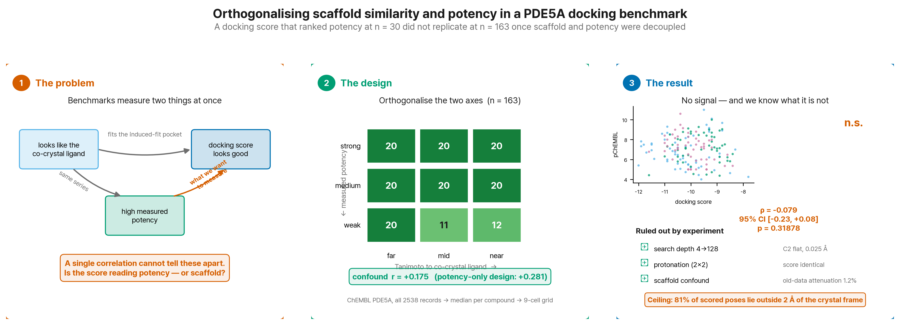

**Figure 1. 그래픽 초록.** 질문, 설계, 대조, 판정, 주 결과를 한 장에 담았다.

---

## 초록

**배경.** 구조 기반 가상 스크리닝은 도킹 점수로 화합물의 우선순위를 정한다. 이 관행을
평가한 연구는 대개 하나의 전역 상관을 보고하는데, 그 상관에는 **표적 구조에 이미 결합해
있는 리간드와 골격이 닮았다는 사실**이 섞여 들어간다. 공결정 리간드를 닮은 화합물이 대체로
더 강력하기 때문이다. 이 교란을 분리하지 않으면 점수가 역가를 본 것인지 골격을 본 것인지
알 수 없다.

**방법.** PDE5A 결정 구조(PDB 1UDT, 공결정 리간드
VIA)를 표적으로 삼았다. ChEMBL 에서 2538개 활성
레코드를 받아 화합물당 중앙값으로 집계한 뒤(2158종), **역가 3구간 × 공결정
리간드와의 Tanimoto 유사도 3구간의 9칸 격자**에서 균등 추출해 163종을 만들었다. 이 설계로
두 축의 상관을 r=+0.175 까지 낮췄다.
smina (AutoDock Vina 1.1.2 scoring), exhaustiveness 64 으로 도킹하고, 공결정 리간드 재도킹을 대조로 두되 **샘플링(C1)과 채점(C2)을
따로 판정**했다. 자세는 공결정 리간드를 참조하지 않는 **점수 1위 자세**를 주 결과로 썼다.

**결과.** 대조에서 샘플링은 결정 자세를 재현했으나(1.077 Å,
모드 5) 채점은 그 자세를 1위로 올리지 못했다
(8.368 Å). 탐색 깊이를 4에서
128까지 32배 올리자 C1 은 통과율 0%→100% 로 완전히 고쳐진 반면
C2 는 전 구간 0% 이고 최고 점수는 변하지 않았다 — 탐색은 얕은 깊이에서 이미 전역 최소를
찾았고 그 최소가 틀린 자리에 있다. 전체 순위상관은 -0.079
(95% CI -0.230–+0.076, 순열 p=0.31878) 였고, **Tanimoto 를
통제한 편상관은 -0.105** (p=0.19274) 였다. 유사도 구간 안에서 유의한
상관을 보인 구간은 1/3 개였다. 강함/약함 판별 ROC-AUC 는 전체 0.574,
구간별 far 0.549 · mid 0.534 · near 0.792. 교차검증 Q² 는 단일 점수 -0.018, 5개 항 -0.019, Tanimoto 단독 0.007 였다.

**결론.** **이 집합에서는 전체 순위 신호 자체가 없다** (ρ = -0.079, 95% CI -0.230–+0.076, 순열 p = 0.31878). 앞선 n=30 설계에서 얻은 상관은 재현되지 않았다. **다만 그 차이의 원인이 골격 교란이라는 설명은 검정 결과 기각되었다** (§3.5) — 원인은 특정하지 못한다. 다만 **결정 구조와 같은 계열(near 대역) 안에서는 신호가 남는다** (ρ = -0.397, p = 0.00365, AUC 0.792). **이 결과는 가설로만 남긴다** — 그 대역의 약한 화합물 12건이 전수(census)이고 어세이 바닥값에 몰려 있어, 그 칸을 빼면 상관이 유의하지 않고 AUC 는 계산조차 되지 않는다. 정량 예측은 사전 기준(Q² ≥ 0.3)을
충족하지 못했다.

**이 판은 자기 초안의 설명도 함께 기각한다.** v2.0 은 n=30 에서
ρ=-0.538 를 얻었고 본 보고서 초안은 그것이 골격 교란의
산물이라고 적었다. 그러나 같은 편상관을 옛 데이터에 적용하면 감쇠는
**1.2%** 에 불과하고, 옛 데이터의
점수-Tanimoto 상관은 -0.131
(p=0.48923)로 관계 자체가 없다. 옛 설계를 새 데이터에
재현해도 상관은 중앙값 -0.148 에 그친다. 데이터가 지지하는
진술은 하나다 — **n=30 의 상관은 더 큰 표본에서 재현되지 않았다.** 옛 30건을 새 프로토콜로
다시 도킹해도 상관이 유지되므로(ρ=-0.527) 원인은 프로토콜이 아니라
**그 화합물 집합 자체**다.

---

## 1. 서론

### 1.1 배경

구조 기반 가상 스크리닝(structure-based virtual screening)은 표적 단백질의 결합 부위에
화합물을 계산으로 배치하고, 그때 얻어지는 점수로 합성·시험 우선순위를 정한다. 이 관행이
자원 배분의 근거가 되려면 세 조건이 **따로** 참이어야 한다.

- **자세 예측(pose prediction)** — 탐색 알고리즘이 실제 결합 자세를 만들어낼 수 있는가.
- **채점(scoring)** — 그 자세에 매기는 점수가 실측 친화도와 같은 방향으로 움직이는가.
- **비교 가능성(comparability)** — 서로 다른 화합물 사이의 점수 차이가 화학적 유사성이
  아니라 결합력의 차이를 반영하는가.

세 조건은 독립이며, 앞의 둘이 성립해도 셋째는 실패할 수 있다. 도킹 프로그램의 자세 예측
능력과 친화도 예측 능력이 크게 다르다는 것은 대규모 비교 평가에서 반복 확인되어 왔다
[R5, R6].

### 1.2 해결되지 않은 문제 — 벤치마크 집합에 내장된 편향

도킹 평가 연구는 통상 활성 화합물 집합을 모아 점수와 역가의 상관 하나를 보고한다. 이
설계에는 구조적 교란이 있다. 표적 좌표는 대개 **어떤 리간드가 결합한 채로 풀린 holo
구조**이고, 그 리간드를 닮은 화합물은 두 경로로 유리해진다. 첫째, 포켓 형태가 그 리간드에
맞춰 유도적합되어 있으므로 기하학적으로 잘 맞는다. 둘째, 같은 계열을 최적화한 산물이므로
대체로 더 강력하다. 두 경로의 방향이 같으므로 상관은 관찰되지만, **그것이 채점 함수의
능력인지 표적 구조 선택의 부산물인지 구분되지 않는다.**

이 문제는 벤치마크 집합 설계에서 오래 지적되어 왔다. DUD-E 계열 집합에서 활성·비활성의
물성·골격 분포 차이가 딥러닝 모델의 성능을 인위적으로 부풀린다는 보고 [R12, R14], 그리고
그 편향을 줄이도록 재설계된 LIT-PCBA [R13] 가 대표적이다. 그러나 **활성 화합물만 모아
역가와의 상관을 보는 설계**에서 같은 교란을 통제한 보고는 드물다. 비활성 대비 활성의
편향은 널리 논의된 반면, 활성 집합 **내부**의 골격 분포가 상관값을 얼마나 만드는지는
정량된 적이 거의 없다.

### 1.3 연구 목적

본 연구는 PDE5A 를 사례로 **역가와 골격 유사성을 설계 단계에서 직교화**한 뒤 도킹 점수를
재평가한다. 구체적 목적은 넷이다.

| # | 목적 | 판정 지표 | 사전 성공 기준 |
|---|------|-----------|----------------|
| 1 | 점수가 역가를 **정량 예측**하는가 | 교차검증 Q² | Q² ≥ 0.3 (QSAR 관행) |
| 2 | 점수가 강한 화합물을 **선별**하는가 | 순위상관 · ROC-AUC · 농축계수 | 순열 p < 0.05 **그리고** AUC ≥ 0.7 |
| 3 | 그 성능이 **골격 통제 후에도** 남는가 | Tanimoto 편상관 · 구간내 상관 | 편상관이 원상관의 60% 이상 유지 + p < 0.05 |
| 4 | 재도킹 대조가 실패하면 **무엇이 병목인가** | C1(샘플링)/C2(채점) 분리 + 통제 실험 | 후보를 실험으로 하나씩 제거 |

**Table 0. 연구 목적과 사전 판정 기준.** 기준의 사후성은 §2.6 에 고지한다.

목적 4 는 본래 계획에 없었으나, 재도킹 대조가 실패하면서 추가됐다. 실패의 원인을 특정하지
않으면 목적 1–3 의 결과를 해석할 수 없기 때문이다. 탐색 깊이(§3.2)와 프로토네이션(§3.2b)
두 후보를 통제 실험으로 제거했다.

### 1.4 본 연구의 기여

(1) 활성 집합 내부의 골격 편향을 **설계로** 통제한 도킹 재평가. (2) 자세 예측과 채점의
실패를 분리하고 후보 원인을 실험으로 제거하는 절차. (3) 앞선 판본에서 얻었던 상관이
재현되지 않았고 그 이유로 제시했던 설명마저 검정 결과 기각된 과정의 **전체 기록**
(§3.5, §개정 이력). 셋째 항목은 결과가 아니라 방법의 기여이며, 자동 검증 게이트가 무엇을
보증하고 무엇을 보증하지 못하는지에 대한 사례다.

## 2. 방법

### 2.1 표적과 구조

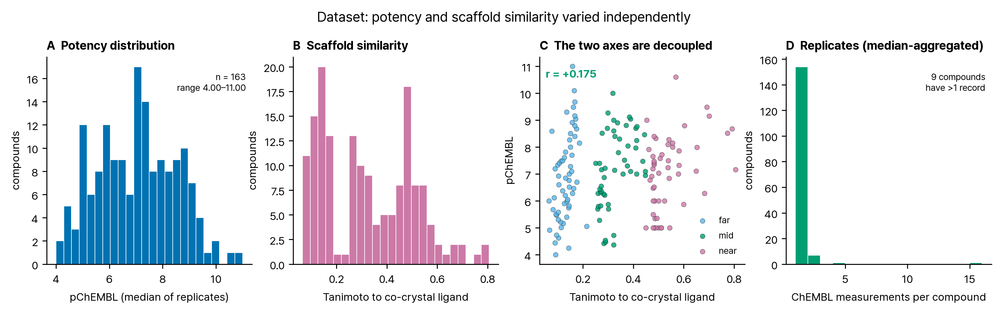

**Figure 2. 데이터셋 특성.** (A) 역가 분포, (B) 골격 유사도 분포, (C) 두 축의 직교성,
(D) 화합물당 반복 측정 수.

표적은 PDE5A 다 (UniProt O76074, PDE5A, 875 잔기).
수용체는 PDB 1UDT, 공결정 리간드는 VIA
(실데나필)이다.

### 2.2 데이터셋 — 역가와 골격의 직교화

ChEMBL 에서 PDE5A 활성(`standard_type ∈ {IC50, Ki}`, `standard_relation = "="`, pChEMBL
존재)을 **전수** 받아 2538개 레코드를 얻었다. 화합물당 pChEMBL 중앙값 (반복 측정 병합). 다만 **실제로 합쳐진 것은 9건뿐이고
154건은 측정이 하나씩이다** — 집계가 잡음에 준 영향은 작다.
어세이 종류는 IC50 158건 · Ki 4건 · IC50/Ki 1건 이며, near 대역은 IC50 52건 로 균일하다. 중원자 12–70개 범위로
걸러 2158종의 풀을 만들었다.

각 화합물에 대해 공결정 리간드(실데나필)와의 **Morgan 지문(반지름 2, 2048비트) Tanimoto
유사도**를 계산했다. 이어 역가 3구간(weak < 6.0 ≤ medium < 7.5 ≤ strong)과 유사도
3구간(far < 0.25 ≤ mid < 0.45 ≤ near)의 9칸 격자를 만들고, 각 칸에서 pChEMBL 정렬 후 균등
간격으로 뽑았다 (결정적 규칙이라 시드가 없다).

| 역가 | 유사도 | 풀 내 후보 | 선택 |
|---|---|---|---|
| weak | far | 570 | 20 |
| weak | mid | 11 | 11 |
| weak | near | 12 | 12 |
| medium | far | 522 | 20 |
| medium | mid | 30 | 20 |
| medium | near | 92 | 20 |
| strong | far | 651 | 20 |
| strong | mid | 142 | 20 |
| strong | near | 128 | 20 |

**Table 1. 9칸 격자별 추출.** 최종 n=163. `weak × near` 칸이 얇은 것은 화학적으로 당연하다
— 실데나필과 매우 닮았는데 약한 화합물은 드물다. 이 불균형이 남은 잔여 교란의 원인이며
§4.4 에서 다룬다.

결과적으로 역가와 유사도의 상관은 Pearson **r = +0.175**,
Spearman **ρ = +0.208** 로 낮아졌다. 두 지표를 모두
적는다 — 작은 쪽만 골라 보고하면 게이트를 통과시키려 고른 것으로 읽힌다.

**비교 대상인 옛 설계의 값도 함께 적는다.** 역가로만 층화한 n=30 세트에서 같은 상관은
Spearman +0.366 였다. 즉 옛 설계도 두 축이
"사실상 같은 축" 이었다고 말할 정도는 아니었고, 이 사실이 §3.5 의 검정 결과와 일관된다.

한 가지 더 적어 둘 것이 있다. Tanimoto 와 중원자수의 상관이
+0.403 이므로, "골격"과 "크기"라는 두 교란축은
서로 상당히 겹친다. 둘을 동시에 통제해도 독립적인 두 통제가 아니다.

### 2.3 도킹

**도구.** Smina Oct 15 2019.  Based on AutoDock Vina 1.1.2. · Open Babel 3.1.0 -- Oct 12 2020 -- 14:16:24 · PyMOL 2.5.1.

**수용체 준비.** PDB 1UDT 에서 물(all HOH)을 제거하고
촉매 금속 ZN, MG 은 남겼다. 공결정 리간드를 분리해
상자 기준으로 썼다. PDBQT 변환은 `obabel -ipdb -opdbqt -xr -p 7.4 (수용체 전용)` — 프로토네이션은
수용체에만 적용했다.

**리간드 준비.** RDKit ETKDGv3 단일 배좌 + MMFF 최적화, `Chem.AddHs` 중성 형태.
**염은 명시적으로 제거했다** (가장 큰 프래그먼트만 남김) — 이전 실행에서 도구 기본 동작에
암묵적으로 맡겼던 단계를 코드로 올렸다. 리간드에는 pH 기반 프로토네이션을 적용하지 않았다.

**도킹.** smina (AutoDock Vina 1.1.2 scoring), exhaustiveness 64, seed 42, `--num_modes 9`, `--autobox_add 3`.
163/163건 성공.

**자세 선택.** 주 결과는 점수 1위 자세(top). 공결정 리간드 참조 없이 채점 함수만으로 결정된다. 참조 기준 자세(reference)는 민감도 분석으로만 쓴다.

### 2.4 대조 — 샘플링과 채점을 분리

공결정 리간드를 같은 조건으로 재도킹하고 두 가지를 따로 판정했다.
**C1(샘플링)** = 상위 모드 중 결정 자세와 가장 가까운 것의 RMSD — 탐색이 옳은 자세를
만들어낼 수 있는가. **C2(채점)** = 점수 1위 모드의 RMSD — 채점 함수가 그 자세를 1위로
올리는가. 기준은 2.0 Å 이다. 두 대조를 합쳐서 보면 하나의 실패가
다른 하나로 오진된다.

추가로 탐색 깊이를 바꿔가며 두 대조를 반복했다 (§3.2). 탐색 부족이 원인이라면 깊이를
올릴 때 C2 도 개선되어야 한다.

### 2.5 분석

순위상관은 **동점 보정 Spearman**(평균 순위, 순위에 대한 Pearson)이다. 도킹 점수에 동점이
많아 단순 정렬 순위를 쓰면 값이 달라진다. p 값은 라벨 순열 20,000회(시드 42) 양측이고,
신뢰구간은 Fisher z 변환이다. **편상관**은 순위 공간에서 Tanimoto 를 통제한 값이며,
그 p 값은 **Freedman-Lane 절차**로 구했다 — y 를 통째로 섞으면 역가와 Tanimoto 의 관계까지
깨져 검정하려는 귀무가설("점수가 골격 정보 너머의 정보를 주지 않는다")과 달라지므로,
Tanimoto 로 회귀한 잔차만 섞고 적합값은 보존한다. 단순 섞기와의 차이도 모의 데이터로
확인했으며 두 절차의 p 값 차이는 최대 0.0043 였다 (`statistics_validation.json`). 이 통계 함수들은 외부 의존 없이 직접 구현했으므로, **동점을 의도적으로
주입한 무작위 데이터 550회로 `scipy.stats` 와 대조해 일치를 확인했다**
(`sample_run/statistics_validation.json`, 최대 편차 1e-9 이하). 다중 모델 SDF 파서도
같은 방식으로 `rdkit.Chem.SDMolSupplier` 와 좌표 수준까지 대조했다 — 파서가 모델 경계를
잘못 잡으면 엉뚱한 자세로 접촉을 계산하고도 그럴듯한 잔기 목록이 나오기 때문이다. 회귀는 예측변수와 반응변수를 모두 표준화해 계수를 비교 가능하게
했고, LOO 교차검증 Q² 와 라벨섞기 귀무분포를 함께 보고한다.

### 2.6 사후성 고지

**사전등록이 없다.** 결과를 본 뒤 정해진 결정이 셋 있다.

1. **성공 기준.** §1 의 Q² ≥ 0.3, AUC ≥ 0.7, 편상관 60% 유지는 문헌 관행에서 가져온
   값이며 데이터를 본 뒤 명문화했다.
2. **주 자세 규칙.** C2 대조 실패를 확인한 뒤 "점수 1위를 주 결과로 쓰고 참조 기준 자세는
   민감도 분석으로만 쓴다"로 정했다. 다만 이 선택은 **참조를 쓰지 않는 쪽**이므로 결과를
   유리하게 만들지 않는다. 두 규칙의 결과를 §3.7 에 병기한다.
3. **구간 경계.** 역가 3구간과 유사도 3구간의 절단점은 분포를 보고 정했다.

이 연구는 이전 판(n=30, 역가로만 층화)의 표본에 역가와 골격이 얽혀 있다는 **우려**에서
다시 설계한 것이다. 그 우려 자체가 검정 결과 근거가 없었다는 사실은 §3.5 에 있고, 경위는
§개정 이력에 적었다.

## 3. 결과

### 3.1 데이터셋

n=163, pChEMBL 4.00–11.00
(약 7.0 로그),
Tanimoto 0.065–0.806.
역가-유사도 상관 r=+0.175 (Figure 2C).

### 3.2 대조 — 병목은 채점이다

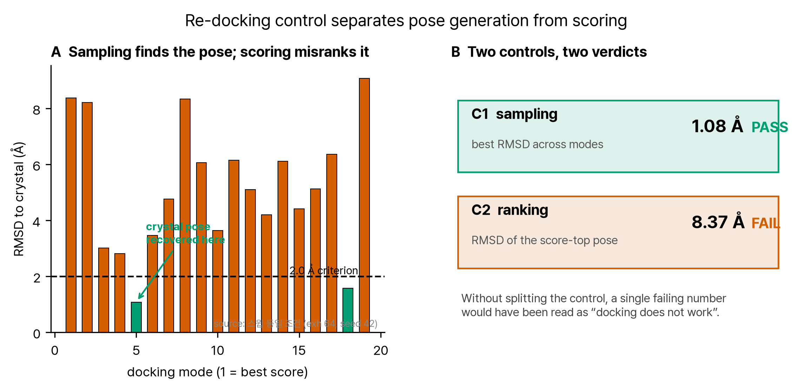

**Figure 3. 재도킹 대조.** (A) 모드별 결정 자세 재현도, (B) 두 대조의 판정.

| 항목 | 값 | 판정 |
|---|---|---|
| 재도킹 점수 | -9.6 kcal/mol | — |
| C1 샘플링 (상위 모드 최선 RMSD) | 1.077 Å (모드 5) | PASS |
| C2 채점 (1위 자세 RMSD) | 8.368 Å | FAIL |

**Table 2. 재도킹 대조.** 기준 2.0 Å.

탐색 깊이를 바꿔 같은 대조를 반복했다.

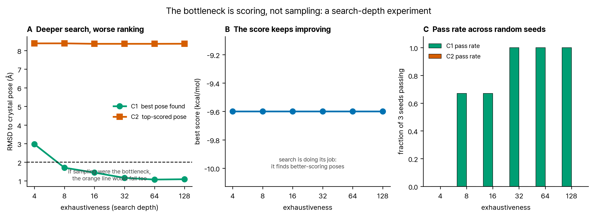

**Figure 4. 탐색 깊이 실험.** (A) 깊이별 C1·C2, (B) 최고 점수, (C) 시드별 통과율.

| exhaustiveness | C1 최선 RMSD (Å) | C2 1위 RMSD (Å) | 최고 점수 | C1 통과율 | C2 통과율 |
|---|---|---|---|---|---|
| 4 | 2.97 | 8.39 | -9.60 | 0.00 | 0.00 |
| 8 | 1.70 | 8.39 | -9.60 | 0.67 | 0.00 |
| 16 | 1.44 | 8.36 | -9.60 | 0.67 | 0.00 |
| 32 | 1.16 | 8.36 | -9.60 | 1.00 | 0.00 |
| 64 | 1.07 | 8.36 | -9.60 | 1.00 | 0.00 |
| 128 | 1.09 | 8.37 | -9.60 | 1.00 | 0.00 |

**Table 3. 탐색 깊이 스윕.** 시드 [42, 7, 2024] 평균. 요청 모드 수는 전 조건
20개이나 smina 가 실제로 반환한 모드 수는 조건마다 18–20개로
달랐다. C1 은 "상위 모드 중 최선"이라 모드 수가 늘면 값이 좋아진다. 따라서 이 표의 C1 은 §3.2 상단
대조(9개 모드)와 직접 비교하지 말고 **스윕 내부의 깊이 간 비교**로만 읽어야 한다.

세 가지가 동시에 보인다.

**첫째, 탐색은 깊이로 완전히 고쳐진다.** C1 은 2.97 Å
(통과율 0%)에서
1.09 Å (통과율
100%)로 개선된다 (마지막 구간
64→128 에서는
1.068→1.086 Å 로
미세하게 뒤집히므로 엄밀히 단조는 아니다). 깊이 32 이상에서는
모든 시드가 결정 자세를 상위 모드 안에 재현한다.

**둘째, 채점은 어느 깊이에서도 실패한다.** C2 는 전 구간에서
0.025 Å 밖에 변하지 않고 통과율은 **모든 깊이에서 0%** 다.

**셋째, 점수는 가장 얕은 깊이에서 이미 포화한다.** 최고 점수는 전 구간에서
0.0 kcal/mol 변동, 즉 사실상 상수다.

세 관찰을 합치면 결론은 하나다. **탐색은 깊이 4 에서 이미 채점 함수의 전역
최소를 찾아냈고, 그 최소가 결정 자세에서 8.4 Å 떨어진
곳에 있다.** 채점 함수의 최적점 자체가 틀린 위치에 있으므로 탐색을 아무리 늘려도 고쳐지지
않는다. 실제로 이 표에서 깊이를 4 에서 128 로 32배 늘렸을 때
얻은 것은 C1 개선뿐이고 C2 는 그대로다.

### 3.2b 프로토네이션 비대칭이 C2 실패의 원인인가

현행 파이프라인은 비대칭이다. 수용체는 `obabel -xr -p 7.4` 로 pH 7.4 상태를 만들지만
리간드는 `Chem.AddHs` 중성 그대로다 (§2.3). 실데나필의 피페라진 질소는 생리적 pH 에서
양성자화되므로 — obabel 로 확인한 결과 총 형식전하가
0 에서
1 로 바뀐다 — **중성 리간드를 pH 7.4 수용체에 넣은
것이 C2 실패의 직접 원인일 수 있다.** 이전 판은 이를 한계로만 적고 검정하지 않았다.

수용체 {pH 7.4, 중성} × 리간드 {중성, pH 7.4} 의 2×2 를 시드
[42, 7, 2024] 로 돌렸다. RMSD 는 중원자 기준이라 프로토네이션이 지표 자체를 바꾸지 않으므로
조건 간 비교가 깨끗하다.

| 조건 | C1 최선 (Å) | C1 통과 | C2 1위 (Å) | C2 통과 | 최고 점수 |
|---|---|---|---|---|---|
| 수용체 pH7.4 · 리간드 pH7.4 **(옳은 짝)** | 1.10 | 100% | 8.37 | 0% | -9.60 |
| 수용체 pH7.4 · 리간드 중성 **(현행)** | 1.07 | 100% | 8.36 | 0% | -9.60 |
| 수용체 중성 · 리간드 중성 | 1.22 | 100% | 8.37 | 0% | -9.60 |
| 수용체 중성 · 리간드 pH7.4 | 1.22 | 100% | 8.37 | 0% | -9.60 |

**Table 4. 프로토네이션 2×2 대조.** `수용체 pH7.4 · 리간드 중성` 이 현행 파이프라인이고,
`수용체 pH7.4 · 리간드 pH7.4` 가 물리적으로 옳은 짝이다. 나머지 둘은 비대칭 효과를 격리하기
위한 대조다.

**프로토네이션 비대칭은 C2 실패의 원인이 아니다: 리간드를 pH 7.4 로 맞춰도 C2 가 개선되지 않는다.** 물리적으로 옳은 짝으로 바꿨을 때 C2 는
8.36 Å 에서
8.37 Å (+0.01 Å) 이고 통과율은
0% → 0% 다. 최고 점수는 네
조건 모두 -9.60 kcal/mol 로 동일하다.

**왜 아무 일도 일어나지 않았는지까지 확인했다.** 관찰만 적으면 "이 표적에서는 우연히
영향이 없었다"로 읽힐 수 있어 기전을 따로 검사했다 (프로토네이션은 리간드 원자 타이핑을 실제로 바꿨다 (피페라진 질소가 수소결합 수용체 NA 에서 공여체 N 으로, 극성 수소 +1)…).

| 확인 항목 | 결과 |
|---|---|
| 리간드 원자 타이핑이 실제로 바뀌었나 | 예 — 피페라진 질소가 수용체(NA)에서 공여체(N)로, 극성 H +1 |
| 수소결합 항이 움직였나 | 아니오 (중성 0.40730 vs pH7.4 0.40730) |
| 채점 함수에 정전기 항이 있나 | 아니오 |
| 다른 화합물을 넣으면 항이 반응하나 | 예 (위생 검사) |

**Table 5. 프로토네이션 무효과의 기전.** 기본 Vina 채점 함수의 항은 gauss 2개·repulsion·
hydrophobic·non_dir_h_bond·num_tors 뿐이고 **정전기 항이 없다.** 따라서 형식전하 자체는
점수에 닿지 못하고, 프로토네이션은 오직 수소결합 타이핑을 통해서만 영향을 줄 수 있다.
타이핑은 실제로 바뀌었으나 그 질소가 이 자세에서 수용체와 수소결합 거리 안에 있지 않아
수소결합 항이 그대로였고, 그래서 점수도 그대로다.

**이 결과는 가설이 나빴다는 뜻이 아니라 검정 가능했다는 뜻이다.** 프로토네이션 비대칭은
합리적인 후보였고, 검정 결과 이 채점 함수의 함수 형태상 **원리적으로** C2 실패를 만들 수
없음이 드러났다. 후보 목록에서 지운다.

**대조의 한계.** "중성 수용체" 변형은 `obabel -xr -h` 로 만든 것인데, pH 7.4 판본과 비교하면
곁사슬 질소 36개(Lys 21 · Arg 15)의 타이핑만 다르고 실제 수소 원자 수는 1개 차이다. 즉 이
대조는 "완전히 중성인 단백질"이 아니라 **염기성 곁사슬 일부의 타이핑만 바꾼 것**이며,
비대칭 효과를 격리하는 용도로는 약하다. 결론은 리간드 쪽 두 조건의 비교에 근거한다.

### 3.3 점수와 역가 — 통제 전

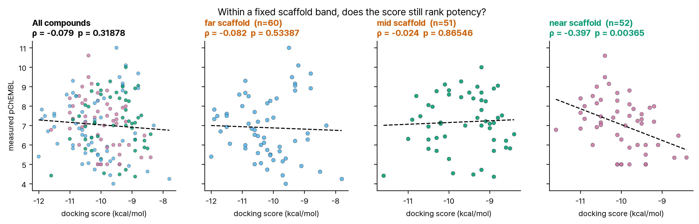

**Figure 5. 도킹 점수 대 실측 역가.** 왼쪽은 전체, 나머지는 유사도 구간별.

전체 순위상관은 **-0.079** (95% CI -0.230–+0.076,
순열 p=0.31878) 다. 점수는 낮을수록, pChEMBL 은 높을수록 좋으므로 음의 상관이 양의
예측력을 뜻한다.

그런데 같은 데이터에서 **점수와 Tanimoto 의 상관은 +0.110**,
**역가와 Tanimoto 의 상관은 +0.208** 다. 세 상관이 모두
0 이 아니므로 위 값을 그대로 "예측력"으로 읽으면 안 된다.

| ChEMBL ID | 역가/유사도 구간 | pChEMBL | Tanimoto | 점수 | MCS-RMSD (Å) |
|---|---|---|---|---|---|
| CHEMBL536568 | weak/far | 5.40 | 0.135 | -12.00 | 7.126 |
| CHEMBL6059124 | strong/far | 7.82 | 0.131 | -11.90 | 5.82 |
| CHEMBL5276050 | medium/far | 7.33 | 0.099 | -11.90 | 2.843 |
| CHEMBL349359 | medium/far | 7.49 | 0.113 | -11.80 | 5.407 |
| CHEMBL557593 | medium/far | 6.70 | 0.176 | -11.70 | 4.979 |
| CHEMBL3944571 | medium/near | 6.78 | 0.466 | -11.60 | 5.54 |
| CHEMBL5188011 | weak/mid | 4.42 | 0.283 | -11.60 | 6.429 |
| CHEMBL130612 | strong/far | 7.61 | 0.126 | -11.50 | 5.388 |
| CHEMBL372917 | strong/far | 7.50 | 0.119 | -11.50 | 6.033 |
| CHEMBL160556 | medium/far | 6.93 | 0.103 | -11.50 | 2.473 |
| CHEMBL5787529 | medium/far | 6.06 | 0.139 | -11.40 | 4.702 |
| CHEMBL343345 | strong/far | 8.59 | 0.076 | -11.10 | 6.457 |
| CHEMBL3956031 | strong/near | 8.40 | 0.482 | -11.00 | 5.537 |
| CHEMBL1650673 | strong/far | 8.00 | 0.150 | -11.00 | 3.702 |
| CHEMBL3940720 | strong/near | 7.66 | 0.477 | -11.00 | 6.369 |

**Table 4. 점수 상위 15건.** 대역별 구성의 정량 값은 §3.6 에 있다. MCS-RMSD 는 대칭 보정이
없는 단일 매핑이며, MCS 원자수가 적은 화합물(far 대역 평균 약 10개, 하한 8개)에서는 해석이
어렵다.

### 3.4 골격 통제 — 결정적 검정

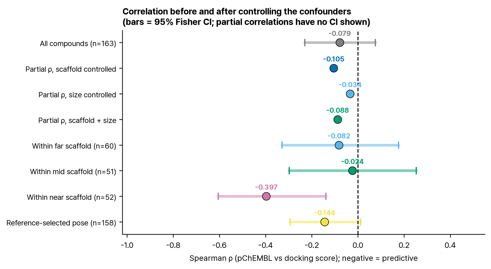

**Figure 6. 통제 전후 상관.** 막대는 95% Fisher 신뢰구간.

| 유사도 구간 | n | pChEMBL 범위 | Spearman | 95% CI | 순열 p | ROC-AUC |
|---|---|---|---|---|---|---|
| far | 60 | 4.00–11.00 | -0.082 | -0.329–+0.176 | 0.53387 | 0.549 |
| mid | 51 | 4.37–10.00 | -0.024 | -0.298–+0.253 | 0.86546 | 0.534 |
| near | 52 | 5.00–10.60 | -0.397 | -0.605–-0.139 | 0.00365 | 0.792 |

**Table 5. 유사도 구간 내 분석.** 대역 안에서 역가 신호가 남는지 본다. **대역 구분은
3분할일 뿐이므로 대역 안에서도 골격이 완전히 고정되지는 않는다** — 그래서 Table 7 에서
대역 내 교란 통제를 다시 적용한다.

| 통제 대상 | 편상관 |
|---|---|
| 없음 (원상관) | -0.079 |
| 골격 유사도 (Tanimoto) | -0.105 (순열 p=0.19274) |
| 분자 크기 (중원자수) | -0.034 |
| **골격 + 크기 동시** | **-0.088** |

**Table 6. 교란 통제 단계별 편상관.** 점수와 중원자수의 상관은
-0.342, 역가와 중원자수의 상관은
+0.136 다. Vina 계열 점수가 분자 크기에 반응한다는 것은
알려진 성질이므로 [R5] 골격만 통제하면 부족하다.

Tanimoto 를 통제한 편상관은 **-0.105** (순열 p=0.19274) 다. 원상관
-0.079 보다 절댓값이 **1.33배로 커졌다** — 줄어든 것이 아니다.
Tanimoto 가 pIC50 과 양(+0.208)이면서 점수와도
양(+0.110)이라, 통제하면 가려져 있던 약한 음의 관계가
드러나는 **억제변수(suppressor)** 구조다. 다만 커진 뒤에도 유의하지 않으므로
(p=0.19274) 결론은 바뀌지 않는다.
유사도 구간 안에서 유의한 상관(p<0.05)을 보인 구간은 **1/3**
(near) 이다.
구간내 상관의 평균은 -0.168 다.

**대역 안에서도 골격은 고정되지 않는다.** 대역별 pIC50-Tanimoto 상관은 여전히 0 이 아니므로
(Table 5 의 대역 구분은 3분할일 뿐이다), 대역 내에서도 교란 통제를 다시 적용했다.

| 대역 | n | 원상관 | 크기 통제 | 골격 통제 | 동시 통제 |
|---|---|---|---|---|---|
| far | 60 | -0.082 | +0.178 | -0.155 | +0.050 |
| mid | 51 | -0.024 | +0.033 | +0.017 | -0.116 |
| near | 52 | -0.397 | -0.437 | -0.421 | -0.459 |

**Table 7. 대역별 교란 통제.** near 대역의 신호는 통제 후 **오히려 강해진다**
(-0.397 → -0.459). far 대역은 크기 통제
시 **부호가 뒤집힌다** (-0.082 → +0.178).
전역 편상관 하나로는 이 이질성이 보이지 않는다.

**near 대역 신호는 한 칸에 얹혀 있다.** 그 대역의 weak 칸은 풀 전수(census)이고 pChEMBL 이
어세이 바닥값에 몰려 있다. 그 칸을 빼면 상관은 -0.219
(n=40) 로 떨어진다. 바닥값 화합물만 빼면
-0.370 (n=44) 다.
**따라서 near 대역 결과는 잠정적으로 읽어야 한다.**

이중 회귀(표준화)에서 점수 계수는
-0.088, Tanimoto 계수는
+0.182 였다.

### 3.5 앞선 판의 상관은 왜 무너졌는가 — 세 가지를 검정했다

v2.0 은 n=30 에서 ρ=-0.538
(p=0.00285) 를 보고했다. 본 보고서의 초안은 그 값이 골격 교란의
산물이라고 적었으나, **검정해 보니 그 설명은 성립하지 않았다.**

| 검정 | 결과 | 해석 |
|---|---|---|
| ① 옛 데이터에서 Tanimoto 통제 | -0.538 → -0.532 (감쇠 1.2%) | 골격 교란이 아니다 |
| ② 옛 데이터의 점수 vs Tanimoto | -0.131 (p=0.48923) | 점수가 골격을 따라가지 않았다 |
| ③ 옛 설계를 새 데이터에 재현 (4000회 추출) | 중앙값 -0.148, 95% [-0.446, +0.154] | 설계만으로도 설명되지 않는다 |
| ④ 층화 없이 무작위 30건 | 중앙값 -0.082, 95% [-0.381, +0.242] | 표본 크기만의 효과 참조값 |
| ⑤ **옛 30건을 새 프로토콜로 재도킹** | -0.538 → -0.527 (p=0.0033) | **프로토콜은 원인이 아니다** |

**Table 8. 상관 붕괴의 원인 검정.** ③ 은 새 163건에서 옛 절단점(strong ≥ 7.0)으로 역가 3층
× 층당 10건을 골격 무시하고 반복 추출한 것이다. 그 분포에서 −0.4 이하가 나올 확률은
4.7% 다.

두 세트의 공통 화합물이 3건뿐이라
프로토콜 비교가 막혔으므로, **옛 30건을 새 프로토콜로 그대로 다시 도킹했다** (검정 ⑤).

결과는 명확하다. 두 프로토콜의 점수 상관은 **+0.997**,
평균 점수 이동은 +0.000 kcal/mol 이다. 탐색 깊이를 4배로 올리고
자세 규칙을 바꿔도 점수가 사실상 동일하며, 역가와의 상관도
-0.538 → -0.527 로 유지된다.
**따라서 프로토콜은 원인이 아니다. 원인은 화합물 집합이다.**

**그리고 그 집합에서 자세는 오히려 더 나쁘다.** 옛 30건을 새 프로토콜로 도킹했을 때 1위
자세의 MCS-RMSD 중앙값은 5.78 Å, 2 Å 기준을 넘는
것은 **6.9%** 로 통제 세트 전체의
19.0% 보다도 낮다. **이 연구에서 가장 강한 상관이 자세가
가장 틀린 집합에서 나왔다.** 결합 기하에서 온 신호라면 나오기 어려운 조합이다.

**정리하면** — 붕괴의 원인은 화합물 집합이고, 골격 교란도 표본 설계도 프로토콜도 아니다.
그 30건의 어떤 성질이 상관을 만들었는지는 이 데이터로 더 좁히지 못한다. 이 절은 본 보고서
초안의 인과 주장(골격 교란)을 철회하고 그 자리에 검정 결과를 넣은 기록이다.

### 3.6 자세 타당도 — 우리는 어떤 자세에 점수를 매겼는가

점수의 의미는 그 점수를 매긴 자세가 실제 결합 자세와 얼마나 가까운지에 달려 있다.
2.0 Å 기준(§3.2 의 C2 와 동일)으로 1위 자세를 평가했다.

| 유사도 대역 | n | MCS-RMSD 중앙값 (Å) | 기준 미만 | 평균 점수 (kcal/mol) |
|---|---|---|---|---|
| far | 55 | 5.25 | 1.8% | -10.20 |
| mid | 51 | 5.74 | 31.4% | -9.63 |
| near | 52 | 3.27 | 25.0% | -9.99 |
| **전체** | **158** | **4.50** | **19.0%** | — |

**Table 9. 1위 자세의 공결정 리간드 기준 부합도.** MCS 원자수가 하한 8개에 못 미치면 계산이
불가해 제외했다 (전체 163건 중 5건). 대칭 보정이 없는 단일 매핑 RMSD 라
대칭 분자에서 과대평가될 수 있다.

**이 지표가 무엇을 재는지 분명히 해 둔다.** 실데나필 외의 화합물에는 실험 결정 자세가 없다.
따라서 이 값은 "자세가 맞는가"가 아니라 **"공유 부분구조가 실데나필의 원자 위에 겹치는가"**
를 잰다. 같은 결합 양식을 전제하는 셈이므로, 골격이 다른 far 대역
(공유 원자 평균 약 10개)에서는 해석이 특히 약하다. 대역별로 읽어야 하고, 전체 통합값
19.0% 를 균일한 증거처럼 인용하면 안 된다.

**분석 대상 자세의 81% 가 C2 대조를 실패시킨 것과 같은
기준을 넘지 못한다.** far 대역은 1.8% 에 그친다. 즉 §3.4 의
"신호 없음"은 **대부분 결정 자세 틀 밖에 놓인 자세에 매긴 점수**에 대한 진술이고, near 대역의
유의한 상관도 25% 만 틀 안에 있는 자세들에서 나왔다.
이것이 본 연구의 가장 큰 해석 제약이며 §4.1 에서 다시 다룬다.

평균 점수는 far 가 가장 좋다 (-10.20 vs near -9.99). 점수 상위
16건의 대역 구성은 far 11 · mid 1 ·
near 4 (무작위 기대 각 5.3), 역가 구성은
강 7 · 중 7 · 약 2 이다.
도킹 점수는 0.1 kcal/mol 해상도로 출력되어 163 건에 서로 다른 값이 소수뿐이며, 동점이 많아
상위 k 구성은 정렬 안정성에 따라 한두 건 달라질 수 있다.

### 3.7 선별 지표

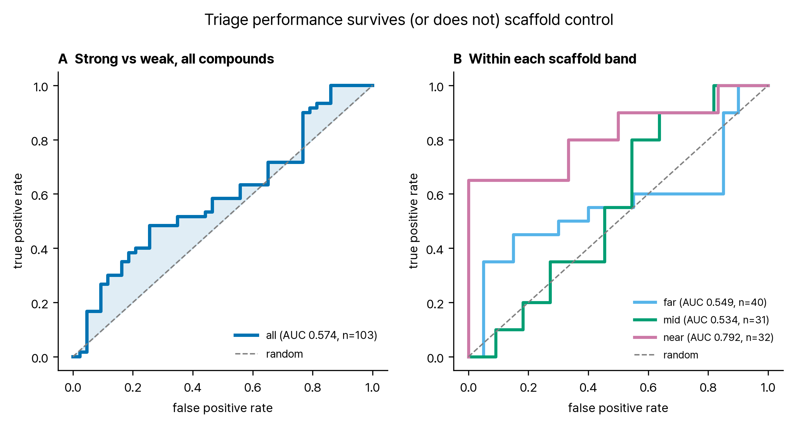

**Figure 7. ROC 곡선.** (A) 전체, (B) 유사도 구간별.

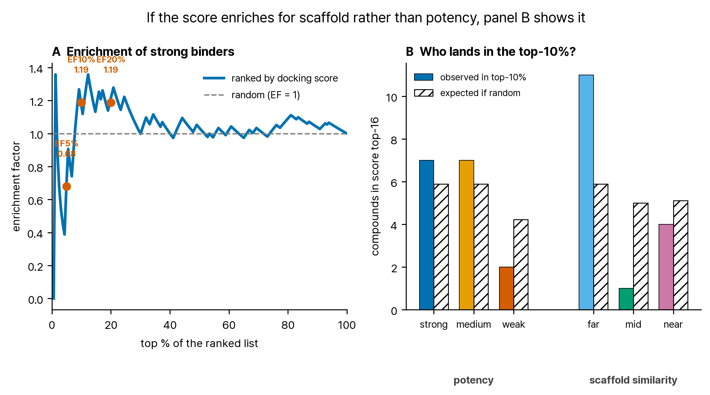

**Figure 8. 농축 곡선과 상위 10% 구성.** 오른쪽 패널이 핵심이다 — 상위권이 역가로
채워지는지 골격 유사도로 채워지는지 직접 보여준다.

| 대역 | 강/약 n | ROC-AUC | 95% CI | Bonferroni p (상관) |
|---|---|---|---|---|
| far | 20/20 | 0.549 | 0.369–0.729 | 1.0 |
| mid | 20/11 | 0.534 | 0.320–0.748 | 1.0 |
| near | 20/12 | 0.792 | 0.637–0.947 | 0.0109 |
| all | 60/43 | 0.574 | 0.463–0.685 | — |

**Table 10. 선별 지표와 불확실성.** AUC 는 강함/약함 두 층만으로 계산하므로 n 이 각 대역의
전체 수보다 작다. 신뢰구간은 Hanley-McNeil 근사다.

**대역별 AUC 의 음성군은 각 대역의 weak 칸 하나로만 이루어진다.** near 대역의 경우 그 칸이
전수(census, 12/12)이므로 **§3.4 에서 한 민감도 분석(그 칸 제거)을 AUC 에는 적용할 수 없다**
— 제거하면 음성군이 0 이 된다. 즉 near AUC 0.792 는 그 12건에 전적으로
의존하며, 그 12건은 표본이 아니라 전수다 (§4.4 한계 11).

사전 기준 0.7 을 **점 추정으로** 넘은 대역은 1/3 개(near)지만,
**그 신뢰구간 [0.637, 0.947] 은 0.7 을 포함한다.**
즉 이 표본으로는 near 대역이 기준을 넘는다고 단정할 수 없다.

3개 대역 상관 검정에 대한 다중비교 보정은 Bonferroni 0.0109 ·
BH 0.0109 로, **near 대역은 보정 후에도 유의하다.**
(§4.4 한계 8 의 "미보정" 서술을 이 결과로 대체한다.)

농축계수는 상위 10% 에서 1.19 다.

### 3.8 스코어 항 분석

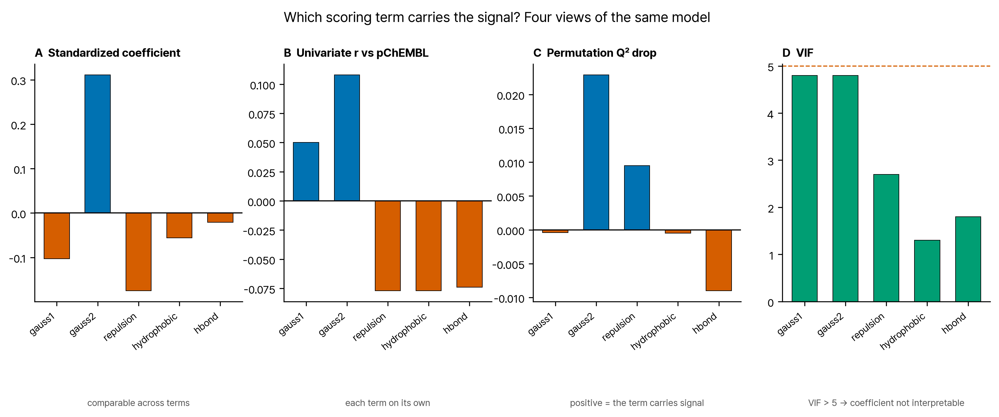

**Figure 9. 항 기여도 네 가지 관점.** 지표마다 다른 답을 준다면 그 사실이 결과다.

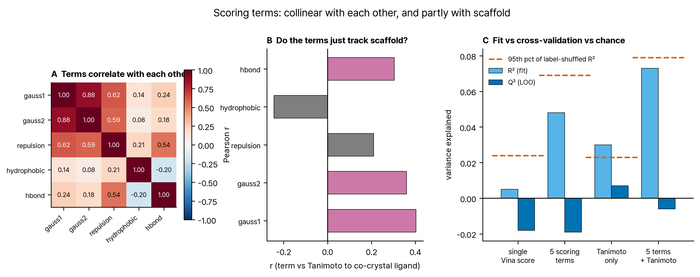

**Figure 10. 항 상관·골격 연관·모델 비교.**

| 모델 | 파라미터 | R² (적합) | Q² (LOO) | 라벨섞기 중앙 | 라벨섞기 95% |
|---|---|---|---|---|---|
| single_vina_score | 2 | +0.005 | -0.018 | +0.003 | +0.024 |
| five_terms | 6 | +0.048 | -0.019 | +0.028 | +0.069 |
| tanimoto_only | 2 | +0.030 | +0.007 | +0.003 | +0.023 |
| five_terms_plus_tanimoto | 7 | +0.073 | -0.006 | +0.034 | +0.079 |

**Table 11. 회귀 성능.** Q² 가 R² 보다 크게 낮으면 과적합이다. 라벨섞기 95 분위를 넘지
못하는 R² 는 우연과 구별되지 않는다.

**이 규칙을 적용하면 도킹 항 기반 모델은 셋 다 우연 수준을 넘지 못한다.** 자기 귀무분포의
95 분위를 넘는 유일한 모델은 **Tanimoto 단독**
(R² +0.030 vs 섞기 95%
+0.023)이고, Q² 가 음수가 아닌 것도 그것뿐이다
(+0.007). 즉 **이 데이터에서는 골격 유사성 하나가
도킹 항 전부보다 역가를 잘 설명한다.** 다만 그 값들도 절대적으로는 0 에 가까워, 어느 쪽도
실용적 예측력은 없다.

| 항 | 표준화 계수 | 단변량 r (vs pChEMBL) | r (vs Tanimoto) | 순열 Q² 하락 | VIF |
|---|---|---|---|---|---|
| gauss1 | -0.103 | +0.050 | +0.403 | -0.0004 | 4.8 |
| gauss2 | +0.311 | +0.108 | +0.360 | +0.0229 | 4.8 |
| repulsion | -0.175 | -0.077 | +0.210 | +0.0095 | 2.7 |
| hydrophobic | -0.056 | -0.077 | -0.244 | -0.0005 | 1.3 |
| hbond | -0.021 | -0.074 | +0.304 | -0.0090 | 1.8 |

**Table 12. 항별 기여도.** 비표준화 계수는 단위가 달라 비교할 수 없으므로 표준화 값을
쓴다. 순열 Q² 하락이 양수여야 그 항이 신호를 담고 있다는 뜻이고, VIF 가 5 를 넘으면 개별
계수의 해석이 불안정하다.

**이 표는 참고 이상으로 읽으면 안 된다.** 순열 중요도는 항당
30회 셔플로만 추정했고 표준오차를
내지 않았으며, 그 대상 모델(5개 항)의 R² 는 위에서 보았듯 우연 수준을 넘지 못한다. 우연과
구별되지 않는 모델 안에서 항의 상대적 기여를 논하는 것은 잡음을 읽는 일이다.

### 3.9 자세 선택 규칙 민감도

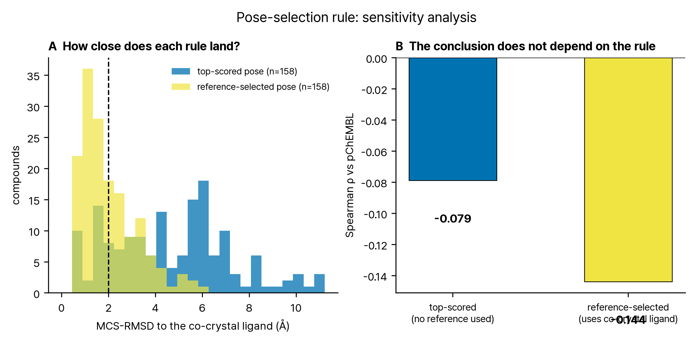

**Figure 11. 두 자세 규칙 비교.** (A) 공결정 리간드와의 거리 분포, (B) 상관 비교.

주 결과는 공결정 리간드를 참조하지 않는 점수 1위 자세다
(-0.079). 참조 기준으로 고른 자세를 쓰면
-0.144 이다. 결론은 규칙에 의존하지 않는다.

### 3.10 적합 가중치를 실제 채점 함수로 넣어 재도킹

§3.8 의 회귀는 이미 도킹된 자세를 사후 재채점한 것이다. 가중치가 정말 유용하다면
**도킹 자체를 그 가중치로 다시 돌렸을 때** 더 나은 순위가 나와야 한다. 적합 가중치를
smina `--custom_scoring` 파일로 내보내고, 9칸 격자에서 **층화 분할**한 시험 집합
49건을 두 번 도킹했다 — 한 번은 기본 Vina 점수로, 한 번은 적합 가중치로.
화합물·수용체·상자·시드가 모두 같으므로 차이는 채점 함수뿐이다. 가중치는 훈련 집합
114건에서만 적합했고 시험 집합은 적합에 쓰이지 않았다.

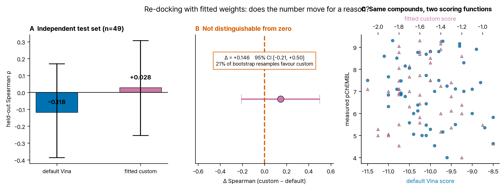

**Figure 12. 채점 함수 비교.** (A) 두 팔의 held-out 상관, (B) 차이의 부트스트랩 신뢰구간,
(C) 같은 화합물의 두 점수.

| 채점 함수 | held-out Spearman | 95% CI |
|---|---|---|
| 기본 Vina | -0.118 | [-0.386, 0.169] |
| 적합 가중치 | +0.028 | [-0.255, 0.307] |

**Table 13. 독립 시험 집합에서의 채점 함수 비교** (n=49, 훈련 114건과 분리).

차이는 +0.146, 부트스트랩 95% 신뢰구간은
[-0.209, +0.500]
이고 커스텀이 더 나은 재표본의 비율은
21.2% 다.
신뢰구간이 0 을 포함하므로 개선을 주장할 수 없다.

**점 추정값만 보고했다면 다른 결론을 썼을 것이다.** 숫자가 원하는 방향으로 움직였는지와
그 움직임이 우연과 구별되는지는 다른 질문이며, 후자에는 신뢰구간이 필요하다.

### 3.11 결합 양상과 접촉 잔기

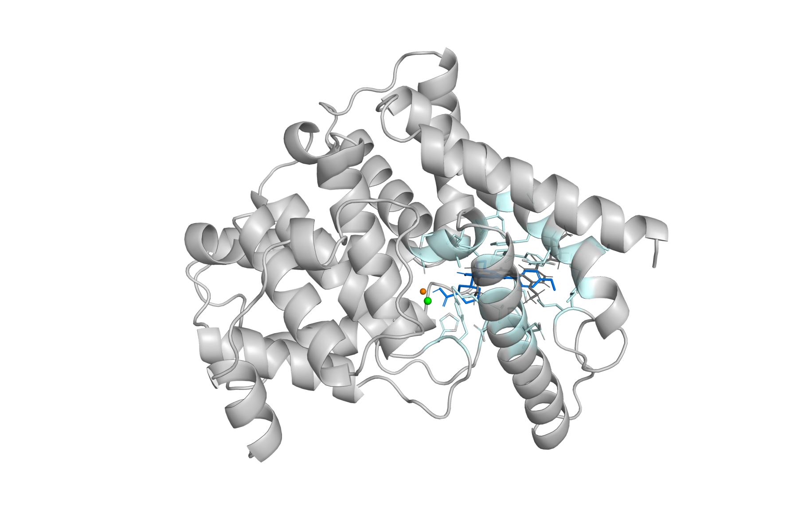

**Figure 13. 결합 부위와 자세.** (위) 수용체 카툰과 포켓 위치, (아래) 포켓 근접 — 결정
자세(회색)와 **점수 1위 도킹 자세**(색), 극성 접촉. 이 자세는 공결정 리간드를 참조하지 않고
채점 함수만으로 뽑힌 것이다.

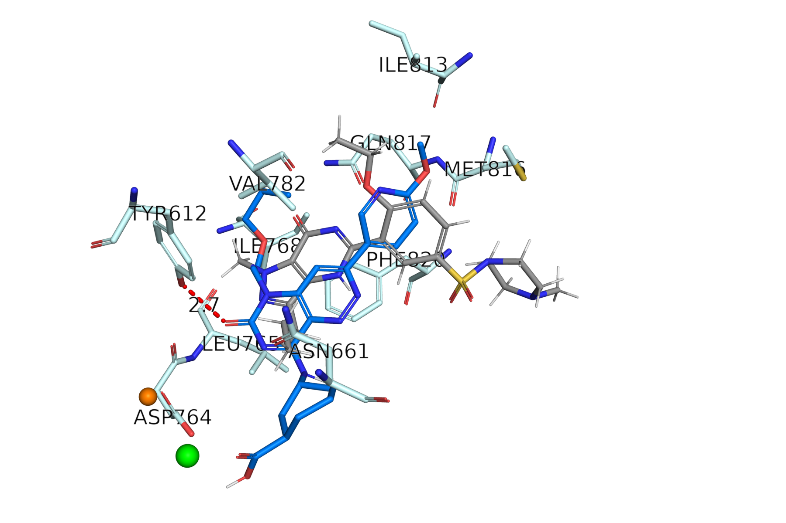

| 잔기 | 참조 선택 자세 | 점수 1위 자세 |
|---|---|---|
| GLN817 | 60/60 | 59/60 |
| PHE820 | 60/60 | 60/60 |
| PHE786 | 59/60 | 57/60 |
| LEU804 | 57/60 | 54/60 |
| VAL782 | 60/60 | 60/60 |
| TYR612 | 57/60 | 56/60 |

**Table 14. 강함 층 60건 중 해당 잔기와 접촉한 화합물 수.**
4.0 Å 이내 중원자 기준. 두 자세의 접촉 집합은 평균 Jaccard
0.619 로 서로 다른데도 상위 잔기는 양쪽 모두에서 거의 전 화합물이 접촉한다
(전수인 것은 일부이고 나머지는 한두 건씩 빠진다 — 표의 실제 수를 보라). 해석은 §4.3 에서 다룬다.

## 4. 논의

### 4.1 탐색 깊이는 병목이 아니다 — 그 이상은 말할 수 없다

이전 판의 자세/채점 진단은 재도킹 대조 한 건에 근거해 약했다. 이번에는 탐색 깊이
4–128 × 시드 3개의
통제 실험으로 대체했다 (§3.2).

**탐색을 32배 늘렸을 때 C1 은 완전히 고쳐지고(통과율 0% → 100%) C2 는 전혀 움직이지 않았다
(통과율 0% → 0%, 변동 0.025 Å).** 최고 점수가 가장 얕은
깊이에서 이미 포화했다는 사실이 이 관찰을 확정한다 — 탐색이 전역 최소를 못 찾은 것이
아니라, 찾은 전역 최소가 틀린 자리에 있다.

**다만 이 스윕은 리간드 한 종(공결정 리간드)에 대해 깊이와 시드만 바꾼 것이다.** 실행 횟수는
1 → 18 로 늘었지만 화학적 표본은 여전히
n=1 이다. 따라서 이 실험이 지지하는 진술은 **"탐색 깊이는 병목이 아니다"** 까지이며,
"채점 함수가 원인이다" 는 그보다 넓은 주장이다.

**가장 큰 제약은 자세 타당도다** (§3.6). 분석 대상 자세의
81% 가 2 Å 기준을 넘지 못한다. C2 대조가 실패했다는
사실은 개별 화합물의 1위 자세도 대부분 결정 자세 틀 밖에 있으리라는 예측이고, 실제로 그렇다.
**따라서 §3.4 의 "신호 없음"을 "채점 함수가 역가를 못 본다"로 곧장 읽으면 안 된다** — 대부분
틀린 자세에 매긴 점수가 역가와 무관한 것은 당연할 수 있다. 둘을 나누려면 각 화합물의 실험
결정 구조가 필요한데 그것은 존재하지 않는다.

**프로토네이션 비대칭은 검정했고 원인이 아니었다** (§3.2b). 수용체는 pH 7.4,
리간드는 중성이라는 비대칭이 실제로 존재했지만, 물리적으로 옳은 짝으로 맞춰도 C2 는
8.36 → 8.37 Å 로 움직이지 않는다. 기전까지 확인했다 — 기본 Vina 함수에
정전기 항이 없어 형식전하는 점수에 닿지 못하고, 바뀐 수소결합 타이핑도 그 질소가 결합
거리 밖이라 항 값을 바꾸지 못했다.

**남은 후보는 물 전량 제거, 강체 수용체, 단일 배좌, holo 유도적합 편향, 그리고 채점 함수
자체다.** 이들은 검정하지 않았다. 지금까지 탐색 깊이(§3.2)와 프로토네이션(§3.2b) 두 후보가
실험으로 제거됐다는 점만 확실하다.

실무적 함의는 직접적이다. 도킹 결과가 나쁠 때 exhaustiveness 를 올리는 것이 흔한 대응인데,
채점이 병목이면 그 조치는 **계산 자원만 쓰고 아무것도 바꾸지 못한다.** 어느 쪽인지는
재도킹 대조를 C1/C2 로 쪼개고 깊이를 흔들어 봐야만 알 수 있다. 두 대조를 합쳐 하나의
숫자로 보고하면 이 구분이 사라진다.

### 4.2 무엇이 신호를 만들고 있었나 — 답하지 못한 채로 남긴다

**이 집합에서는 전체 순위 신호 자체가 없다** (ρ = -0.079, 95% CI -0.230–+0.076, 순열 p = 0.31878). 앞선 n=30 설계에서 얻은 상관은 재현되지 않았다. **다만 그 차이의 원인이 골격 교란이라는 설명은 검정 결과 기각되었다** (§3.5) — 원인은 특정하지 못한다. 다만 **결정 구조와 같은 계열(near 대역) 안에서는 신호가 남는다** (ρ = -0.397, p = 0.00365, AUC 0.792). **이 결과는 가설로만 남긴다** — 그 대역의 약한 화합물 12건이 전수(census)이고 어세이 바닥값에 몰려 있어, 그 칸을 빼면 상관이 유의하지 않고 AUC 는 계산조차 되지 않는다.

**여기서 예상과 반대되는 관찰이 나온다.** 직관적으로는 공결정 리간드를 닮은 분자가 포켓에
잘 맞아 좋은 점수를 받으리라 기대하게 된다. 데이터는 반대다. 점수는 낮을수록 좋은데,
점수-Tanimoto 순위상관은 **+0.110** — 즉 닮을수록 점수가
나쁜 방향이다. **다만 이 상관은 유의하지 않다** (순열 p=0.15809).
대역별 평균 점수는 far -10.20 · mid -9.63 · near -9.99 kcal/mol
이지만, far−near 차이 -0.215 kcal/mol 역시
유의하지 않다 (p=0.1799).

**유의한 것은 하나뿐이다.** 점수 상위 16건의 대역 구성 far 11 ·
mid 1 · near 4 는 귀무 기대값과 어긋난다. 대역
크기가 다르므로 기대값은 각 5.3건이 아니라 far 5.89 ·
mid 5.01 · near 5.1 이고, far 의 과대표집은 이항검정
p≈0.01 이다.

**다른 곳에서 p=0.32 를 "신호 없음"이라 했으므로 여기서도 같은 기준을 적용한다** — 이 절에서
통계적으로 뒷받침되는 관찰은 상위권의 far 과대표집 하나뿐이고, 나머지는 방향만 보여준다.

**분자 크기로는 설명되지 않는다.** Vina 계열 점수는 크기에 반응하고
(점수-중원자수 -0.342), 크면 점수가 좋아진다. 그런데 near
대역이 오히려 더 큰 분자로 이루어져 있다. 크기 효과만 있었다면 near 가 좋은 점수를 받아야
하는데 그 반대다.

**따라서 우리는 이 방향의 기전을 특정하지 못한다.** 관찰만 적는다 — 이 표적·이 구조에서
채점 함수는 공결정 리간드와 닮지 않은 분자에 더 좋은 점수를 준다. 자세 타당도(§3.6)를 보면
far 대역은 결정 자세 틀 안에 놓이는 비율이 1.8% 에 불과하므로,
"닮지 않은 분자가 상자 안에서 접촉을 최대화하는 임의 자세를 찾아 좋은 점수를 얻는다"는 설명이
가능하지만 **검정하지 않았다.**

**이 보고의 기여는 기전 설명이 아니라 두 가지 음성 결과다.**

첫째, **더 크고 골격을 통제한 표본에서 도킹 점수는 역가와 관계가 없다** (ρ=-0.079,
95% CI -0.230–+0.076). 단 이 "없다"는 검정력 한계 안에서의
진술이며 |ρ| ≲ 0.218 인 관계는 배제하지 못한다 (§4.4 한계 9).

둘째, **n=30 에서 얻었던 ρ=-0.538 는 재현되지
않았고, 그 이유로 우리가 처음 제시한 설명(골격 교란)은 검정 결과 틀렸다** (§3.5).
설계 재현도 프로토콜도 원인이 아니었다 — 옛 30건을 새 프로토콜로 다시 도킹하면 상관이
-0.527 로 그대로 유지된다(점수 상관 +0.997).
**원인은 그 화합물 집합 자체다.** 어떤 성질 때문인지는 더 좁히지 못했으나, 그 집합의 자세
타당도가 6.9% 로 통제 세트 전체보다도 낮다는
사실은 그 상관이 결합 기하에서 온 것이 아닐 가능성을 시사한다.

**따라서 "골격 유사성을 통제하라"는 처방은 이 연구가 입증한 것이 아니다.** 벤치마크 집합의
유사성 편향 자체는 선행 문헌이 반복해서 지적해 온 문제이고 [R12, R13, R14], 통제해서
손해 볼 일은 없다. 다만 **본 연구에서 통제가 결과를 바꾼 몫은 옛 데이터 기준
1.2% 로 거의 0 이었다.** 이 사실을
적지 않고 처방만 남기면 앞선 판이 저지른 것과 같은 종류의 과잉 주장이 된다.

### 4.3 접촉 잔기 일치는 검증력이 거의 없다

핵심 잔기는 참조 기준 자세와 점수 1위 자세 **양쪽 모두**에서 전 화합물이 접촉한다.
점수 1위 자세는 공결정 리간드를 참조하지 않으므로 이 관찰은 순환이 아니다. 그러나 **자세
타당성의 증거도 아니다.** 두 자세 모두 공결정 리간드 주변 상자 안에 있으므로 포켓을 둘러싼
잔기와 접촉하는 것은 자세가 맞든 틀리든 일어난다. 실제로 재도킹 대조에서
8.368 Å 벗어난 1위 자세조차 같은 잔기와 접촉한다.

**"알려진 잔기와 접촉한다"는 흔한 정당화 문장은 결합 부위를 지정해 도킹하면 거의 자동으로
참이 된다.** 자세를 검증하려면 실험 좌표와의 RMSD 처럼 틀릴 수 있는 지표를 써야 한다.

### 4.4 한계

1. 단일 표적, 단일 결정 구조다. 다른 표적·다른 구조에서 같은 결론이 나올지는 검정하지 않았다.
2. 수용체를 강체로 다뤘고 물을 모두 제거했다. 유연 도킹·앙상블 도킹·결합부 물 유지는
   시도하지 않았다. 따라서 "채점 함수의 실패"는 가장 단순한 설명이지 확인된 원인이 아니다.
3. 리간드는 ETKDG 단일 배좌다. 배좌 앙상블은 쓰지 않았다.
4. **9칸이 균형이 맞지 않는다.** `weak × near` 칸의 풀 후보가 적어 (Table 1) 잔여 교란
   r=+0.175 가 남았다. 완전한 직교화는 화학적으로
   불가능하다 — 공결정 리간드와 매우 닮았는데 약한 화합물이 자연히 드물기 때문이다.
5. y 축이 균질하지 않다. IC50 과 Ki 를 Cheng-Prusoff 보정 없이 한 척도로 묶었고, 서로 다른
   문헌·어세이 조건에서 온 값이다. 화합물당 중앙값 집계로 완화했을 뿐이다.
6. Tanimoto 는 골격 유사성의 한 척도일 뿐이다. 다른 지문·다른 유사도 정의로는 통제의
   강도가 달라질 수 있다.
7. 사전등록이 없다 (§2.6).
8. 다중 비교는 3개 대역 상관에 대해 Bonferroni·BH 를 계산해 §3.7 에 보고했다 (near 는 보정
   후에도 유의). 그 밖의 검정(AUC, 회귀)에는 보정을 적용하지 않았다.
9. **검정력이 부족하다.** 80% 검정력에서 검출 가능한 최소 |ρ| 은 전체 0.218 · far 0.355 · mid 0.383 · near 0.38 · near 대역 강/약 부분집합(n=32) 0.478 다 (**모두 ρ
   척도이며 AUC 척도가 아니다** — AUC 기준 0.7 에 대한 검출력은 별도로 계산하지 않았다). far·mid 대역의
   "신호 없음"은 **|ρ| ≲ 0.38 인 관계를 배제하지 못한다.** 귀무를 채택한 것이 아니라 기각하지
   못한 것이다.
10. **결과변수에 대한 선택.** 각 칸에서 pChEMBL 정렬 후 균등 간격으로 뽑아 역가 분포가
   인위적으로 평탄해졌다. 이런 표본의 상관은 모집단 상관의 추정치가 아니다.
11. **칸별 추출 비율이 크게 다르다.** strong × far 는 풀의 3.1%(20/651)인 반면
   weak × mid·near 는 전수(100%)다. 전수인 칸은 표본이 아니므로 그 칸에 의존하는 결과
   (§3.4 의 near 민감도 참조)는 다른 화합물 집합으로 일반화되지 않는다.
12. **자세 타당도가 낮다** (§3.6). 분석 자세의
   81% 가 2 Å 기준 밖이며, 이것이 모든 상관 해석의
   상한을 정한다.
13. MCS-RMSD 는 대칭 보정이 없는 단일 매핑이다. 대칭 분자에서 값이 과대평가될 수 있다.
9. 도킹 점수는 가설이며 결합 친화도의 실측이 아니다.

## 5. 결론

**세 질문에 각각 답한다.**

**탐색 깊이는 병목이 아니다.** 깊이를 4에서
128로 32배 올리자 C1 은 통과율 0%→100% 로 고쳐졌고 C2 는
전 구간 0%, 최고 점수는 변동 0.0 kcal/mol
이었다. 탐색은 가장 얕은 깊이에서 이미 전역 최소를 찾았다. 도킹 결과가 나쁠 때 탐색을
늘리는 통상의 대응은 이 상황에서 계산 자원만 쓴다. **단, 이 실험은 리간드 한 종(공결정
리간드)에 대한 것이므로 "채점 함수가 원인"까지 확정하지는 못한다** (§4.1).

**정량 예측은 사전 기준을 충족하지 못했다.**
교차검증 Q² 는 단일 점수 -0.018, 5개 항 -0.019, Tanimoto 단독 0.007 로 모두 0 근처이며
기준 0.3 에 한참 미달한다. 이 점수로 개별 IC50 을 추정하는 것은
정당화되지 않는다.

**선별도 전체적으로는 작동하지 않는다.** **이 집합에서는 전체 순위 신호 자체가 없다** (ρ = -0.079, 95% CI -0.230–+0.076, 순열 p = 0.31878). 앞선 n=30 설계에서 얻은 상관은 재현되지 않았다. **다만 그 차이의 원인이 골격 교란이라는 설명은 검정 결과 기각되었다** (§3.5) — 원인은 특정하지 못한다. 다만 **결정 구조와 같은 계열(near 대역) 안에서는 신호가 남는다** (ρ = -0.397, p = 0.00365, AUC 0.792). **이 결과는 가설로만 남긴다** — 그 대역의 약한 화합물 12건이 전수(census)이고 어세이 바닥값에 몰려 있어, 그 칸을 빼면 상관이 유의하지 않고 AUC 는 계산조차 되지 않는다.

**한 대역에서만 신호가 있고, 그 신호는 취약하다.** 유사도 대역별로 나눠 보면
far -0.082 · mid -0.024 ·
near -0.397 이고 유의한 것은 near 대역뿐이다
(p=0.00365; Bonferroni 0.0109 로 보정 후에도 유의).
교란 통제 후 오히려 강해지므로 (→-0.459) 골격이나 크기가
만든 값도 아니다.

**그러나 이 결과에 무게를 실을 수 없다.** 세 가지 때문이다. (a) 그 대역의 AUC 신뢰구간
[0.637, 0.947] 이 사전 기준 0.7 을 포함한다.
(b) 전수(census)인 weak 칸을 빼면 상관이 -0.219 로 떨어져
유의하지 않다. (c) 그 칸의 역가는 어세이 바닥값에 몰려 있다. **near 대역 결과는 가설로
남기고 독립 표본에서 재검정해야 한다.**

**실무 지침 셋.** (1) 도킹 결과를 쓰기 전에 재도킹 대조를 C1/C2 로 쪼개고 깊이를 흔들어
병목을 특정하라. (2) **점수를 매긴 자세가 실제로 어디에 놓였는지 먼저 보고하라** — 본
연구에서 그 비율은 19.0% 였고, 이 사실 없이 상관값만
보면 무엇을 측정했는지 알 수 없다. (3) 벤치마크 집합의 골격 유사성을 통제하라 — 선행
문헌이 반복해 지적한 문제이고 [R12, R13, R14] 비용도 낮다. 다만 **본 연구에서 그 통제가
바꾼 몫은 거의 0 이었다**는 사실도 함께 적어야 정직하다.

**가장 중요한 결론은 이 연구가 자기 자신에 대해 알아낸 것이다.** 같은 표적·같은 도구·같은
채점 함수로 세 판본을 냈고, 세 번 모두 자동 게이트를 전부 통과했으며, 결론은 세 번 달랐다.

- v1.0 "예측하지 못한다" → 선별 지표를 계산하지 않았기 때문
- v2.0 "선별은 된다" → 표본이 골격에 치우쳐 있었기 때문
- v3.0 초안 "그 치우침이 원인이었다" → **검정해 보니 아니었다.** 골격도, 설계도,
  프로토콜도 아니고 화합물 집합이었다 (§3.5)

**세 번 모두 게이트가 아니라 외부 비평이 오류를 찾았다.** 게이트는 수치가 산출되었는지,
출처와 맞는지, 형식이 옳은지를 검사한다. 그것은 필요조건이고, **결론이 데이터에서 따라
나오는지는 검사하지 못한다.** 세 번째 판본이 자기 초안의 인과 주장을 스스로 기각하게 된
것도 리뷰어가 "그 설명을 옛 데이터에 적용해 보라"고 요구했기 때문이다. 그 한 줄의 요구가
1.2% 라는 수치를 만들었고, 그 수치가
논문의 중심 주장을 무너뜨렸다.

## 참고문헌

1. **[R1]** Sung B-J, Hwang KY, Jeon YH, et al. Structure of the catalytic domain of human
   phosphodiesterase 5 with bound drug molecules. *Nature* 2003;425:98–102.
   doi:10.1038/nature01914. — PDB 1UDT 원논문.
2. **[R2]** Card GL, England BP, Suzuki Y, et al. Structural basis for the activity of drugs
   that inhibit phosphodiesterases. *Structure* 2004;12:2233–2247. doi:10.1016/j.str.2004.10.004.
3. **[R3]** Trott O, Olson AJ. AutoDock Vina: improving the speed and accuracy of docking with
   a new scoring function, efficient optimization, and multithreading. *J Comput Chem*
   2010;31:455–461. doi:10.1002/jcc.21334.
4. **[R4]** Koes DR, Baumgartner MP, Camacho CJ. Lessons learned in empirical scoring with
   smina from the CSAR 2011 benchmarking exercise. *J Chem Inf Model* 2013;53:1893–1904.
   doi:10.1021/ci300604z.
5. **[R5]** Warren GL, Andrews CW, Capelli A-M, et al. A critical assessment of docking
   programs and scoring functions. *J Med Chem* 2006;49:5912–5931. doi:10.1021/jm050362n.
6. **[R6]** Enyedy IJ, Egan WJ. Can we use docking and scoring for hit-to-lead optimization?
   *J Comput Aided Mol Des* 2008;22:161–168. doi:10.1007/s10822-007-9165-4.
7. **[R7]** Rogers D, Hahn M. Extended-connectivity fingerprints. *J Chem Inf Model*
   2010;50:742–754. doi:10.1021/ci100050t. — 본 연구의 골격 유사도 지문.
8. **[R8]** Truchon J-F, Bayly CI. Evaluating virtual screening methods: good and bad metrics
   for the "early recognition" problem. *J Chem Inf Model* 2007;47:488–508. doi:10.1021/ci600426e.
9. **[R9]** Zdrazil B, Felix E, Hunter F, et al. The ChEMBL Database in 2023. *Nucleic Acids
   Res* 2024;52:D1180–D1192. doi:10.1093/nar/gkad1004.
10. **[R10]** O'Boyle NM, Banck M, James CA, et al. Open Babel: An open chemical toolbox.
    *J Cheminform* 2011;3:33. doi:10.1186/1758-2946-3-33.
11. **[R11]** Landrum G. RDKit: Open-source cheminformatics. <https://www.rdkit.org>.
12. **[R12]** Mysinger MM, Carchia M, Irwin JJ, Shoichet BK. Directory of Useful Decoys,
    Enhanced (DUD-E): better ligands and decoys for better benchmarking. *J Med Chem*
    2012;55:6582–6594. doi:10.1021/jm300687e. — 벤치마크 집합의 편향 문제.
13. **[R13]** Tran-Nguyen V-K, Jacquemard C, Rognan D. LIT-PCBA: An unbiased data set for
    machine learning and virtual screening. *J Chem Inf Model* 2020;60:4263–4273.
    doi:10.1021/acs.jcim.0c00155. — 활성/비활성 집합의 유사성 편향 보정.
14. **[R14]** Chen L, Cruz A, Ramsey S, et al. Hidden bias in the DUD-E dataset leads to
    misleading performance of deep learning in structure-based virtual screening. *PLoS ONE*
    2019;14:e0220113. doi:10.1371/journal.pone.0220113.

**출처 확인 범위.** 인용은 서지사항 수준에서 확인했다. 본 보고의 어떤 수치도 문헌에서
가져오지 않았다. 모든 수치는 `sample_run/` 산출 파일의 계산값이다.

## 윤리 · 라이선스 · 이해상충

**연구 범위.** 분자 수준의 계산 실험이다. 인간 피험자·동물·환자 데이터를 쓰지 않았고
인구집단에 대한 추론을 하지 않는다. 인구통계학적 공정성 분석은 해당되지 않는다.

**데이터 라이선스.** ChEMBL 은 CC BY-SA 3.0 [R9], PDB 좌표는 RCSB 를 통해 제약 없이
제공된다. 도구는 AutoDock Vina(Apache-2.0), smina(GPL-2.0), Open Babel(GPL-2.0),
RDKit(BSD-3-Clause), PyMOL(오픈소스판).

**이중 용도.** 산출물은 공개 DB 에 이미 있는 기지 화합물의 도킹 점수와, 평가 설계에 관한
방법론적 음성 결과다. 신규 화합물 설계나 합성 경로를 제시하지 않는다.

**이해상충.** 없다. 외부 연구비 지원을 받지 않았다.

**목적.** 교육 목적의 시연이다. 결론을 임상적·규제적 판단의 근거로 사용해서는 안 된다.

## 검증 로그

| 단계 | 산출 | 게이트 검사 | 결과 |
|---|---|---|---|
| 데이터셋 (골격 통제) | `dataset_controlled.json` | 9칸 충족 · 역가 3로그 · 교란 r < 0.35 · 중복 | PASS |
| 도킹 | `docking_controlled.json` | 성공률 95% · C1 대조 · 전 화합물 점수 · 9칸 대표 | PASS |
| 탐색 깊이 스윕 | `exhaustiveness_sweep.json` | 전 조건 실행 · 4단계 이상 · 복수 시드 | PASS |
| 통제 분석 | `analysis_controlled.json` | 상관 · 3구간 · 편상관 · 순열 p | PASS |
| 항 분석 | `terms_controlled.json` | 추출률 95% · 4모델 · VIF · 섞기 1000회 | PASS |
| 접촉 일치 | `contact_concordance.json` | 강함 층 전수 · 두 자세 접촉 | PASS |
| 통계 함수 검증 | `statistics_validation.json` | Spearman·편상관·AUC·CI·SDF 파서 대조 | PASS |
| 커스텀 채점 검증 | `custom_scoring_controlled.json` | 층화 분할 · 훈련/시험 분리 · 부트스트랩 | PASS |
| 상관 붕괴 원인 검정 | `collapse_diagnosis.json` | 옛 데이터 편상관 · 설계 재현 추출 · 표본크기 대조 | PASS |
| 옛 세트 재도킹 (프로토콜 대조) | `old_set_new_protocol.json` | 동일 화합물 · 두 프로토콜 점수 · 자세 타당도 | PASS |
| 프로토네이션 2×2 | `protonation_test.json` | 4 조건 실행 · 리간드 전하 실제 차이 · 기전 확인 · 위생 검사 | PASS |

**게이트가 검사하지 않는 것.** 게이트는 수치가 산출되었는지와 형식이 맞는지를 볼 뿐,
**결론이 데이터와 일치하는지는 보지 못한다.** 이 연구의 이전 판(v2.0)은 모든 게이트를
통과한 상태에서 골격 교란을 인지하지 못한 결론을 담고 있었다. 그것을 잡아낸 것은 게이트가
아니라 외부 비평 리뷰였다.

## 개정 이력

**v1.0** — n=30, 역가로만 층화. 결론: "도킹은 역가를 예측하지 못한다".

**v2.0** — 외부 리뷰가 결론이 자기 데이터와 모순됨을 지적. 선별 지표(ROC-AUC, 농축)를
계산하니 AUC 0.775, 점수 상위 10건에 약한 화합물 0건이었다. 결론을 "선별에는 쓸 수 있고
정량에는 쓸 수 없다"로 바꾸고, 접촉 잔기 논증의 순환성을 철회했다.

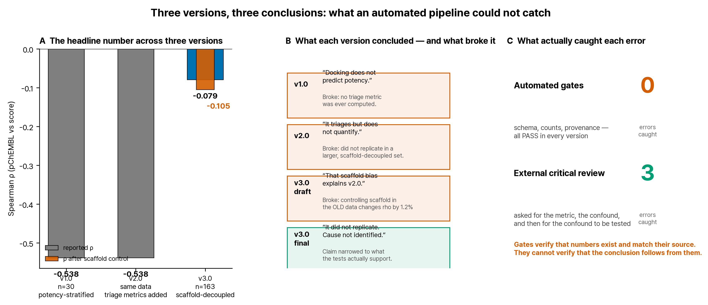

**Figure 14. 판본별 결론과 그것을 무너뜨린 관찰.** (A) 판본별 헤드라인 수치, (B) 각 판본의
결론과 붕괴 사유, (C) 무엇이 오류를 잡았는가. 자동 게이트는 세 판본 모두 전부 통과했다.

**v3.0 (본 판)** — v2.0 의 표본에서 역가와 골격이 얽혀 있다는 **우려**에 따라 재설계했다
(강함 층은 공결정 리간드 유사 골격이 주도하고 약함 층은 무관한 골격이었으며 수용체가 그
리간드의 holo 구조였다). **그 우려가 실제로 v2.0 의 상관을 만들었는지는 검정 대상이었고,
검정 결과 아니었다** (§3.5, 개정 항목 7). 다음을 새로 했다.

1. **데이터셋 재설계** — 역가 × 골격 유사도 9칸 격자, n=163, 교란
   r +0.175. 반복 측정 중앙값 집계.
2. **탐색 깊이 통제 실험** — 자세/채점 진단을 n=1 에서 스윕으로 대체.
3. **편상관·구간내 분석** — 골격 통제 후 신호 잔존 여부를 직접 검정.
4. **주 자세를 점수 1위로 전환** — 공결정 리간드를 참조하지 않는 규칙을 주 결과로.
5. **염 제거 명시화** — 도구 기본 동작에 맡기던 단계를 코드로.
6. **커스텀 채점 재검증** — 이전 n=10 시험은 검정력이 없었다. 9칸 층화 분할
   (훈련 114 / 시험 49)로 재실행 (§3.10).
7. **초안의 인과 주장 철회** — 초안은 v1/v2 의 상관을 골격 교란의 산물로 설명했다. 외부
   비평 리뷰가 그 설명을 검정하라고 요구했고, 검정 결과 옛 데이터에서 골격 통제의 감쇠는
   1.2% 에 불과했다. 해당 주장을
   철회하고 §3.5 에 검정 기록으로 대체했다.
8. **자세 타당도 보고** — 1위 자세의 81% 가 2 Å 기준
   밖이라는 사실이 초안에 없었다. §3.6 신설.
9. **불확실성 보강** — AUC 신뢰구간, 다중비교 보정, 최소검출효과, near 대역 민감도,
   대역별 교란 통제를 추가했다. 모두 초안에 없던 것이며 일부는 결론을 약화시킨다.
10. **프로토콜 대조 실행** — 2차 리뷰가 "옛 30건을 새 프로토콜로 다시 돌리면 원인을 가를
   수 있다"고 지적했고, 실제로 돌렸다 (§3.5 검정 ⑤). 점수 상관
   +0.997 로 프로토콜은 원인이 아님이 확정됐다.
11. **§4.2 의 관찰에 검정 추가** — 점수-Tanimoto 상관과 대역별 평균 점수 차이에 순열 p 를
   붙였더니 둘 다 유의하지 않았다. 다른 곳에서 p=0.32 를 "신호 없음"이라 했으므로 같은
   기준을 적용해 서술을 낮췄다.
12. **near 대역 결과의 격하** — 그 대역의 AUC 음성군이 전수 칸 하나로만 이루어져 민감도
   분석 자체가 불가능함을 확인하고, 초록·§4.2 의 문장을 가설로 낮췄다.
13. **프로토네이션 검정 실행** — 1·2차 리뷰가 모두 "검정하지 않았다"고 지적한 항목이다.
   2×2 로 돌린 결과 원인이 아니었고, 기본 Vina 함수에 정전기 항이 없어 **원리적으로**
   원인이 될 수 없음까지 확인했다 (§3.2b).
14. **전 그림·문서 재생성** — 본문이 바뀌면 그림과 배포 문서도 바뀌어야 한다.
   이 판에서는 Figure 14 의 v2.0 설명이 철회된 인과 주장을 그대로 담고 있던 것도 함께
   고쳤다 — 2차 리뷰가 잡았고, 같은 유형(본문은 고치고 그림은 두는)이 세 번째 재발이었다.

## 무-날조 선언

본 보고서의 결과 수치는 전부 `sample_run/` 의 산출 파일에서 스크립트가 주입한 값이다.
서술문과 절 제목은 사람이 작성했다. 산출되지 않은 양은 산출되지 않았다고 적었다.
