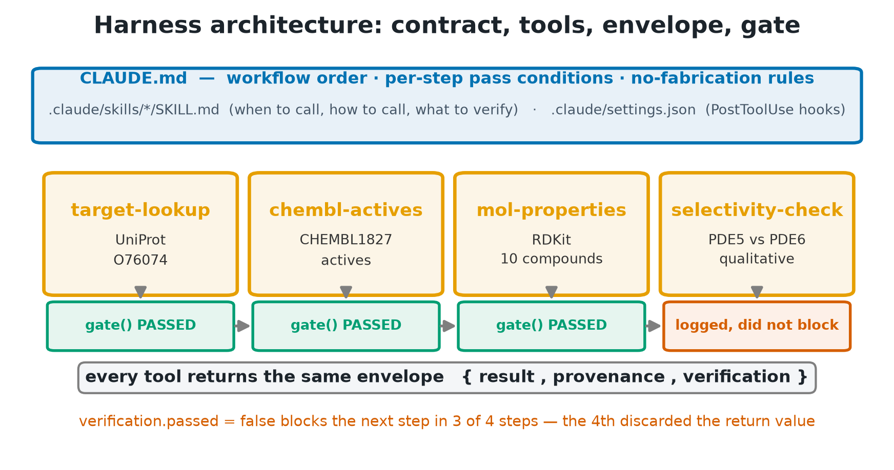
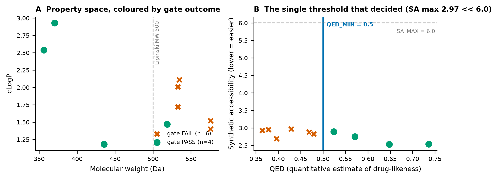
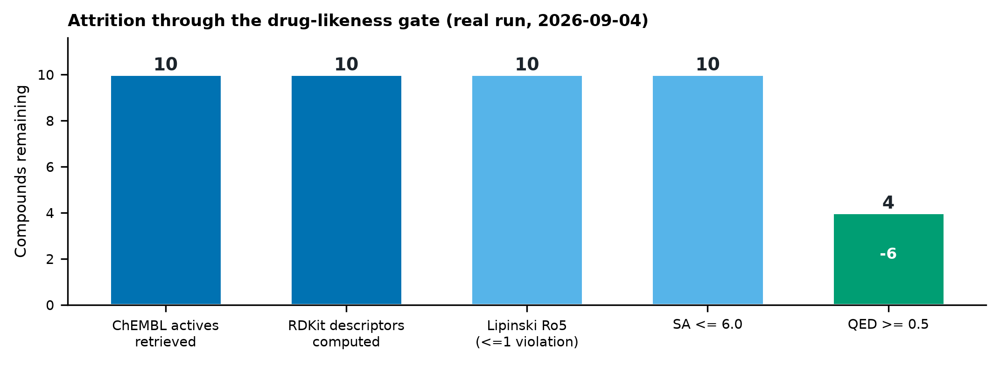
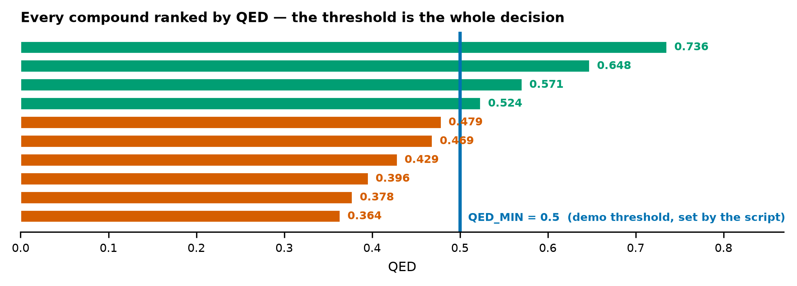
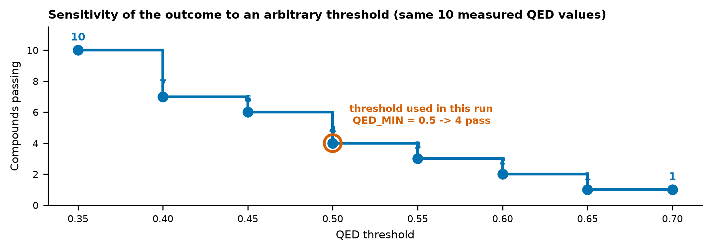

# 검증 게이트를 갖춘 신약탐색 에이전트 하네스의 단일 실행 기록
## 그리고 그 게이트 중 둘이 반증 불가능했다는 발견

**작성일** 2026-09-04 · **버전** 2.0 (1차 리뷰 반영) · **원자료** `sample_run/run_stdout.json`
(SHA-256 앞 16자리 `a3ba8468fddc8355`), `sample_run/run_gatelog.txt` (`a7d3df2602cabb01`)


**Figure 1. Graphical abstract.** 개념도이며 수치는 실행 요약만 포함한다.

---

## 초록

**배경.** 언어모델이 도구 없이 수치와 식별자를 지어내는 문제는 실측된 현상이다 [7-10].
프롬프트로 금지하는 방식은 지켜졌는지 확인할 수단이 없어, 규약을 실행 가능한 검사로
옮기는 접근이 제안되어 왔다 [11-14].

**방법.** 규약을 `CLAUDE.md` 에 적고, 도구가 공통 봉투 `{result, provenance, verification}`
를 반환하며, 단계마다 `gate()` 가 `verification.passed` 를 읽는 하네스를 PDE5A
(O76074) 저해제 선별에 적용해 1회 실행했다 [6,5]. 물성은 RDKit 으로 계산했다 [4].

**결과.** 게이트 로그는 4단계 전부 PASSED 였다. 그러나 로그만으로는 강제 여부를
알 수 없었다. 코드를 검토한 결과 (i) selectivity 게이트는 반환값이 버려져 실패해도 차단하지
않았고, (ii) 그 게이트의 검사 항목이 전부 모듈 상수를 읽어 어떤 입력으로도 실패할 수 없었으며,
(iii) 계약이 규정한 다섯 번째 게이트의 판정 함수는 호출되는 곳이 없었다. 세 결함을 수정한 뒤
음성 대조를 실행해 실패 봉투가 실제로 다음 단계를 막는 것을 처음으로 관측했다.
화합물 10건 중 약물성 게이트를 4건이 통과했다.

**결론.** 게이트 통과 로그는 그 자체로 강제의 증거가 아니다. 실패가 관측 가능해야 통과가
정보를 갖는다. 본 연구는 문서-전용 조건과의 비교를 수행하지 않았으므로 "문서보다 코드가
낫다"는 일반 명제는 주장하지 않는다.

**핵심어** 에이전트 하네스 · 검증 게이트 · 반증 가능성 · 음성 대조 · PDE5A

---

## 1. 서론

언어모델이 존재하지 않는 문헌과 수치를 그럴듯하게 생성하는 현상은 여러 분야에서
정량적으로 보고되었다 [7-10]. 완화책으로 출력 스키마 강제 [11], 자기 검증 [12],
도구 호출 [13] 이 제안되었고, 소프트웨어 공학에서는 계약을 코드로 표현하는 오래된
전통이 있다 [14]. 최근의 자율 과학 에이전트 연구는 이런 장치를 실제 실험 파이프라인에
붙이기 시작했다 [15-17].

본 보고는 그런 하네스 하나를 PDE5A 저해제 선별에 적용해 1회 실행하고, **게이트가 실제로
강제되는지**를 검사한 기록이다. 결과적으로 초기 판정은 부정적이었고, 그 발견이 이 보고의
주된 내용이 되었다.

## 2. 방법



**Figure 2. 하네스 구조.**

### 2.1 계약 계층

| 파일 | 기록 내용 | 강제력 |
|------|-----------|--------|
| `CLAUDE.md` | 워크플로 순서, 단계별 통과 조건, 무-날조 규칙 | 문서 — 강제력 없음 |
| `.claude/skills/*/SKILL.md` | 도구별 호출 시점·명령·검증 항목 (11종) | 문서 — 강제력 없음 |
| `.claude/settings.json` + 훅 2종 | `PostToolUse` 리마인더 | **비차단 경고**. 두 훅 모두 모든 경로에서 `exit 0` 이며, CLI 실행에서는 발화하지 않는다 |
| `scripts/verify.py` `gate()` | `verification.passed` 판정 | bool 반환. **차단은 호출자 책임** |

**Table 1. 계약 계층과 실제 강제력.** 네 층 중 실행 시점에 강제력을 갖는 것은 마지막 하나뿐이며,
그것도 호출자가 반환값을 검사할 때만 작동한다.

### 2.2 대상 선정

표적은 UniProt `O76074` 조회로 확인했다 [6]. 후보는 ChEMBL `CHEMBL1827` 의
활성 레코드 10건이다 [5]. **정렬을 지정하지 않은 조회 결과의 앞에서부터 10건을 취한
것이며 무작위 추출도 대표 추출도 아니다.**

제외 기준은 세 가지다 (`scripts/chembl_actives.py:27-28`).

- `standard_type` 이 IC50 또는 Ki 인 레코드만 — Kd, EC50, 퍼센트 저해는 제외
- `standard_relation` 이 등호인 레코드만 — 부등호 보고치 제외
- `pchembl_value` 가 결측이 아닌 레코드만

이 필터들은 잘 특성화된 화합물 쪽으로 코호트를 좁힌다. 조회 시각과 질의는
`sample_run/envelopes/chembl-actives.json` 의 provenance 에 있으나, 그 query 문자열은
위 세 필터 중 첫 번째만 담고 있어 불완전하다.

### 2.3 게이트 규칙

약물성 게이트는 `Ro5 위반 1개까지 허용 AND QED >= 0.5 AND SA <= 6.0` 이다.
Ro5 는 Lipinski 규칙 [2], QED 는 Bickerton 등의 지표 [1], SA 는 Ertl 과 Schuffenhauer 의
합성 접근성 점수 [3] 이며 계산은 RDKit 구현을 따랐다 [4]. 두 임계값은
`scripts/mol_properties.py` 의 상수이고 주석에 "데모 임계(교육용)"로 표기되어 있다.

### 2.4 재현 정보

`python run_harness.py run` 을 **두 번** 실행했다. 1회차는 §3.2 의 결함을 발견하기 전,
2회차는 결함을 고친 뒤다. 두 실행의 화합물 10건은 동일하다(SMILES·QED 전수 대조).

**문서 머리의 해시와 §3.1 의 게이트 로그는 수정 후 2회차 실행본이다.** §3.2 가 서술하는
결함은 1회차 코드에 있던 것이며, 그때의 selectivity 봉투는
`sample_run/selectivity_envelope.json` 에 따로 보존했다. 그 파일에는 수정 전 검사 4개가
그대로 남아 있어 결함을 직접 확인할 수 있다. 저장소는 git 으로 관리하며 수정 후 상태를 커밋 `c312b5a` 로
고정했다. 수정 전 코드는 커밋되지 않았으므로 그 시점의 증거는 위 봉투 파일과
`sample_run/REVIEW_LOG.md` 가 유일한 감사 경로다. 단계별 봉투 전문은 `sample_run/envelopes/` 에 있다.

실행 환경은 rdkit 2026.3.5 · chembl-webresource-client 0.10.9 · requests 2.32.3 · matplotlib 3.11.1 · numpy 1.26.4 · python 3.12.3 이며 `sample_run/environment.json` 에 기록했다.
데이터베이스는 **ChEMBL_37** 이다 (`sample_run/chembl_status.json`).
QED 와 SA 는 RDKit 버전에 의존하고 조회 결과는 ChEMBL 릴리스에 의존하므로,
이 두 값을 맞추지 않으면 Table 3 이 그대로 재현되지 않는다.

저장소의 `Dockerfile` 도 같은 파이썬 버전을 고정하도록 맞췄다(이전에는 3.10 을 고정해
실제 실행 환경과 어긋나 있었다).

그림 6장은 위 원자료로 생성했으며 각 PNG 옆 `.meta.json` 의 `source_sha256` 이
문서 머리의 원자료 해시와 일치한다. 그림과 본문이 같은 데이터를 가리키는지
기계적으로 확인할 수 있다.

## 3. 결과

### 3.1 게이트 로그와 그 해석의 한계

```
[VERIFY-GATE:target-lookup] PASSED
[VERIFY-GATE:chembl-actives] PASSED
[VERIFY-GATE:mol-properties] PASSED
[VERIFY-GATE:selectivity-check] PASSED
```

4단계 전부 PASSED 다. 그러나 이 로그만으로는 강제 여부를 판정할 수 없다.
실패가 한 건도 없는 관측은 "게이트가 작동한다"는 가설과 "게이트가 실패할 수 없다"는 가설이
똑같이 예측하기 때문이다 (논의는 §4.1).

### 3.2 강제력 실사

코드를 단계별로 검사한 결과는 다음과 같다.

| 검사 대상 | 실행 시점 강제 | 근거 |
|-----------|----------------|------|
| target-lookup 게이트 | 차단함 | `if env is None or not gate(...): return 1` |
| chembl-actives 게이트 | 차단함 | 동일 |
| mol-properties 게이트 | 차단함 | 동일. 단 약물성 판정(`gate_pass`)은 `verification.passed` 에 포함되지 않아 10건 전부 탈락해도 이 단계는 통과한다 |
| selectivity 게이트 | **차단하지 않았음** | 반환값을 버림 (`if env is not None: gate(...)`) |
| selectivity 검사 항목 | **반증 불가능했음** | 4개 항목이 전부 모듈 리터럴 상수를 읽음. 쓰레기 SMILES 입력으로도 `passed=True` |
| report 게이트 (`numbers_backed`) | **실행되지 않음** | 실행 코드에 호출자 0곳 |
| PostToolUse 훅 2종 | 강제 아님 | 비차단 리마인더, 모든 경로 `exit 0`, CLI 실행에서 미발화 |

**Table 2. 강제력 실사 결과.** 계약이 규정한 검사 다섯 중 셋만 실행 시점에 차단력을 가졌다.

### 3.3 수정과 음성 대조

세 결함을 고쳤다. selectivity 게이트가 반환값을 검사하도록 바꾸고, 그 검사 항목을 산출물
전수 스캔과 입력 SMILES 파싱으로 교체했으며, `gate()` 의 docstring 을 실제 동작에 맞게
정정하고, 봉투 전문을 아카이브하도록 했다.

수정 후 음성 대조를 실행했다.

```
[VERIFY-GATE:target-lookup] PASSED
[VERIFY-GATE:selectivity-check(주입)] FAILED → 다음 단계 진행 금지. 실패 항목: ['입력 SMILES 유효성 — 파싱 실패']
```

세 가지를 관측했다. (A) `mol_properties.py` 에 파싱 불가 SMILES 를 주자 실제 도구가
`passed=false` 봉투를 만들었다. (B) 수정된 `selectivity.py` 에 쓰레기 SMILES 를 주자
`입력 SMILES 유효성 — 파싱 실패` 로 처음으로 실패했다. (C) 그 실패 봉투를 게이트에 넣자
다음 단계가 실행되지 않았다.

**단서**: (C) 는 `run_harness` 의 게이트 호출 규약을 재현한 것이며 `run_harness.py`
프로세스를 실패 입력으로 끝까지 돌린 것은 아니다.

더 중요한 단서가 있다. 파이프라인은 `selectivity.py` 를 SMILES 인자 없이 호출하고 그때
`result` 는 여전히 상수만 담는다. 그 결과 **보고된 실행에서는 수정 후에도 그 단계의 검사
다섯 개가 전부 공허하게 통과한다** — 입력 SMILES 검사는 "입력 없음(해당 없음)" 으로,
fold 스캔은 상수 딕셔너리를 훑어 0건으로 통과한다. 수정의 효력은 수동 호출에서만
확인된 상태이며, 파이프라인에 결선하려면 `run_harness.py` 가 화합물 SMILES 를
전달하도록 바꿔야 한다. 이 관측이 왜 필요했는지는
§4.1 에서 논한다.

### 3.4 표적과 화합물

UniProt 조회 결과는 accession `O76074`, 유전자 `PDE5A`,
단백질 `cGMP-specific 3',5'-cyclic phosphodiesterase`, 길이 875 잔기다.



**Figure 3. 물성 공간과 게이트 결과.**



**Figure 4. 단계별 잔존 건수.**

| ChEMBL ID | MW | cLogP | HBD | HBA | TPSA | QED | SA | Ro5 | 게이트 |
|---|---|---|---|---|---|---|---|---|---|
| CHEMBL87901 | 356.4 | 2.54 | 1 | 4 | 81.9 | 0.736 | 2.54 | 통과 | **PASS** |
| CHEMBL87954 | 370.5 | 2.93 | 1 | 4 | 81.9 | 0.648 | 2.53 | 통과 | **PASS** |
| CHEMBL433418 | 435.5 | 1.18 | 2 | 6 | 142.1 | 0.571 | 2.75 | 통과 | **PASS** |
| CHEMBL86743 | 518.6 | 1.47 | 1 | 7 | 122.5 | 0.524 | 2.89 | 통과 | **PASS** |
| CHEMBL87202 | 518.6 | 1.47 | 1 | 7 | 122.5 | 0.479 | 2.83 | 통과 | **FAIL** |
| CHEMBL86578 | 532.7 | 1.72 | 1 | 7 | 122.5 | 0.469 | 2.88 | 통과 | **FAIL** |
| CHEMBL327772 | 575.7 | 1.52 | 1 | 7 | 142.8 | 0.429 | 2.97 | 통과 | **FAIL** |
| CHEMBL313561 | 532.7 | 2.01 | 1 | 7 | 122.5 | 0.396 | 2.69 | 통과 | **FAIL** |
| CHEMBL90164 | 534.7 | 2.11 | 1 | 7 | 122.5 | 0.378 | 2.95 | 통과 | **FAIL** |
| CHEMBL313197 | 575.7 | 1.40 | 1 | 8 | 125.8 | 0.364 | 2.93 | 통과 | **FAIL** |

**Table 3. 화합물 10건의 RDKit 실계산 물성.** QED 내림차순.



**Figure 5. QED 순 정렬과 임계선.** 임계 바로 아래와 위가 인접해 있다.

4/10 이 게이트를 통과했다. 조건별로는 Ro5 가 10/10 통과, SA 가 10/10 통과
(최대 2.97), QED 가 4/10 통과다.

### 3.5 선택성 — 산출하지 않은 것

selectivity 도구는 정량 fold-selectivity 를 산출하지 않았다
(`quantitative_selectivity_predicted = false`). 대신 교차 억제 기전을 서술하고 후속 확인
근거 3건을 남겼다. 기전 요지는 다음과 같다.

> PDE5 저해제는 PDE5와 구조적으로 유사한 망막 PDE6를 부분적으로 교차 억제할 수 있다. PDE6가 억제되면 광수용체 내 cGMP 항상성이 교란되어 일시적 색각 이상(청녹색 색조 변화, cyanopsia)·광민감성이 유발될 수 있다. 이는 PDE5 저해제 계열에서 관찰되는 대표적 표적-외(off-target) 시각...

후속 확인 항목은 병렬 IC50/Ki 어세이, 화합물별 PDE5/PDE6 활성값 병렬 조회, 문헌 보고
선택성 비의 출처 명시다. 도구가 인용한 문헌은 [18,19] 이다. 전문은
`sample_run/envelopes/selectivity-check.json` 에 있다.

## 4. 논의

### 4.1 통과 로그는 강제의 증거가 아니다

이 보고의 초판은 게이트 로그 4줄을 근거로 "계약이 강제되었다"고 적었다.
그 진술은 틀렸다. 같은 로그를 만드는 게이트 중 하나는 실패해도 아무것도 막지 않았고,
그 게이트의 검사는 입력과 무관한 상수 비교였다. 로그의 `PASSED` 는 "검사를 통과했다"가
아니라 "검사가 통과를 반환하도록 작성되어 있다"는 뜻이었다.

교훈은 하네스를 부정하는 쪽이 아니라 반대다. **게이트에는 음성 대조가 필요하다.**
통과만 관측된 파이프라인은 검증된 것이 아니라 아직 시험되지 않은 것이다.

이 논리는 새로운 것이 아니라 소프트웨어 테스팅의 오래된 결론과 같다. 뮤테이션 테스팅은
프로그램에 의도적 결함을 심어 테스트가 그것을 잡아내는지 보는 방법으로, 테스트 스위트가
"통과한다"는 사실만으로는 결함 검출력을 알 수 없다는 문제의식에서 출발했다 [20].
본 실행의 selectivity 게이트는 그 관점에서 보면 **어떤 뮤턴트도 죽이지 못하는 테스트**였다.
에이전트 하네스의 게이트도 같은 기준으로 평가해야 한다.

### 4.2 임계값의 임의성



**Figure 6. 임계 민감도.**

| QED 임계 | 0.35 | 0.40 | 0.45 | 0.50 | 0.55 | 0.60 | 0.65 | 0.70 |
|---|---|---|---|---|---|---|---|---|
| 통과 건수 | 10 | 7 | 6 | 4 | 3 | 2 | 1 | 1 |

**Table 4. 임계별 통과 건수.** 측정값은 동일하고 임계만 달라졌다.

실제로 쓴 0.5 에서 좌우로 0.05 씩 옮기면 통과가 6건과 3건으로
갈린다. 0.35 까지 내리면 10건 전부가 통과해 게이트가 아무것도 걸러내지 못한다.
임계 근방에서는 QED 0.479 가 탈락하고 0.524 가 통과했는데
차이는 0.045 다. 산출은 측정값보다 임계 선택에 민감하다.

### 4.3 Lipinski 규칙은 왜 아무것도 걸러내지 못했는가

Ro5 는 10/10 을 통과시켜 한 건도 탈락시키지 않았다. 초판은 이를 "이미 최적화된 계열이라
위반이 드물기 때문"으로 해석했으나 **데이터가 그 해석을 반박한다.** 실제로는 7/10 이
MW 500 을 초과하고, 위반이 하나도 없는 화합물은 3/10 뿐이다. Ro5 가 걸러내지 못한
이유는 위반이 드물어서가 아니라 **게이트가 위반 1개를 허용하기 때문**이다. 위반 0개를
요구했다면 7/10 이 탈락해 QED 보다 강한 필터가 되었을 것이다.

### 4.4 경쟁 가설

초판에는 경쟁 설명이 없었다. 본 판은 셋을 명시한다.

- **H2 (술어 상수성).** 게이트가 통과한 것은 강제가 작동해서가 아니라 술어가 상수여서다.
  판별: 술어를 입력 의존으로 바꾸고 잘못된 입력을 준다. **본 연구에서 수행했고 H2 가
  selectivity 게이트에 대해 참이었다.**
- **H3 (입력이 우연히 깨끗함).** 차단 경로는 정상이나 실패 입력이 없었을 뿐이다.
  판별: 실패 봉투를 주입한다. 수행 결과 차단이 관측되어 나머지 세 게이트에 대해 H3 가 기각된다.
- **H4 (판정 분리).** 약물성 결과가 무엇이든 단계는 통과한다. 판별: `gate_pass` 가
  `verification.passed` 에 포함되는지 본다. 포함되지 않으므로 **H4 는 참이다.**

### 4.5 한계

1. 단일 실행이며 반복이 없다. 통계적 추론을 하지 않았고 p값·신뢰구간이 없다.
2. **대조군이 없다.** 문서-전용 조건을 실행하지 않았으므로 "문서보다 코드가 낫다"는
   비교 주장은 본 연구가 뒷받침하지 못한다.
3. 화합물 10건은 단일 화학형 계열에 가깝다. 원인은 정렬 미지정보다 §2.2 의 세 제외
   필터에 더 크게 있을 수 있다. pchembl 비결측과 등호 관계를 요구하면 잘 연구된 단일
   시리즈가 남기 쉽다. `CLAUDE.md` 가 참조 약물로 든 sildenafil·tadalafil·vardenafil·avanafil
   은 포함되지 않았다.
4. 라이브러리·데이터베이스 버전을 고정하지 않아 수치 재현이 보장되지 않는다.
5. **§3.2 강제력 실사와 §4.2 임계 스윕을 포함해 본 보고의 모든 분석은 결과를 본 뒤
   설계된 사후(post-hoc) 탐색이다.** 사전 등록된 프로토콜이 없다. 임계 스윕의 범위
   0.35–0.70 도 "전부 통과" 지점이 보이도록 사후에 정한 것이다.
6. **경계 조건**: 게이트 술어가 입력에 의존하지 않으면 하네스는 무력하다.
   본 실행의 selectivity 게이트가 그 사례였다.

### 독립 재현 계획

본 보고는 자기 감사이므로 저자가 자기 코드를 검사했다는 한계가 있다. 다음을 제안한다.
제3자가 `sample_run/environment.json` 의 버전과 `chembl_status.json` 의 릴리스를 맞춘 뒤
`python run_harness.py run` 과 `python scripts/negative_control.py` 를 실행해 게이트 로그와
Table 3 을 대조한다. 나아가 같은 감사 절차(강제력 실사표 + 음성 대조)를 다른 공개 하네스에
적용해, 게이트 반증 불가능성이 이 저장소 고유의 문제인지 일반적 현상인지 확인하는 것이
다음 단계다. 본 보고는 후자를 주장하지 않는다.

### 4.6 임상 번역 격차

본 보고의 어떤 수치도 임상 효능이나 안전성을 시사하지 않는다. 물성은 합성 이전 단계의
계산 지표이며, 후보 판단에는 결합 실험, 세포 어세이, 약동학, 독성 평가가 필요하다.
게이트 통과는 규약 준수를 뜻할 뿐 화합물이 유망하다는 뜻이 아니다.

## 5. 결론

게이트가 통과했다는 로그는 강제의 증거가 아니다. 본 실행에서 계약이 규정한 검사 다섯 중
셋만 실행 시점에 차단력을 가졌고, 하나는 어떤 입력으로도 실패할 수 없었으며, 하나는 아예
호출되지 않았다. 결함을 고치고 음성 대조를 수행한 뒤에야 차단을 관측할 수 있었다.

실무적 함의는 하나다. **게이트를 만들었으면 실패시켜 보아야 한다.** 통과만 본 게이트는
검증된 것이 아니다.

## 데이터 출처와 사용 조건

표적 정보는 UniProt Knowledgebase [6], 활성물질은 ChEMBL [5] 에서 공개 API 로 조회했다.
UniProt 데이터는 CC BY 4.0, ChEMBL 데이터는 CC BY-SA 3.0 으로 배포되며 두 자원 모두 출처
표시 조건으로 재사용이 허용된다. RDKit [4] 은 BSD 3-Clause 다. 본 보고는 교육·연구 목적의
비상업적 시연이다.

## 오남용 가능성 (dual-use)

본 파이프라인은 PDE5 저해제 유사체 목록에 PASS 라벨을 붙여 출력한다. 미승인 PDE5 유사체를
건강기능식품에 불법 혼입하는 사례는 실재하는 규제 문제다. 여기서의 PASS 는 계산 물성이
임의 임계를 넘었다는 뜻일 뿐 안전성·유효성·합법성과 무관하며, 본 산출물을 제품 개발 근거로
사용해서는 안 된다.

## 인체 대상 여부

본 연구는 인체 대상 데이터를 사용하지 않았다. 공개 데이터베이스의 분자 수준 정보만 다루며
인구집단 추론을 하지 않으므로 IRB 심의 대상이 아니다.

## 이해상충

없음. 본 보고는 강의 실습 자료로 작성되었으며 상업적 이해관계가 없다.

## 데이터 및 코드 가용성

- 원자료: `sample_run/run_stdout.json`, `run_gatelog.txt`, `envelopes/`, `negative_control_gatelog.txt`
- 그림: `scripts/make_figures.py` (각 PNG 옆 `.meta.json` 에 출처·해시)
- 본문: `scripts/make_report.py` (결과 수치를 원자료에서 주입)
- 음성 대조: `scripts/negative_control.py`

## 무-날조 선언 (범위 명시)

본 보고서의 **결과 수치**(Table 3·4, 통과 건수, QED 범위, 해시, 표적 필드)는 스크립트가
원자료에서 주입한 값이다. **환경 버전 문자열도 기계 캡처값이다** —
`scripts/capture_environment.py` 가 `importlib.metadata.version()` 으로 실행 인터프리터에서
읽어 `sample_run/environment.json` 에 쓰고, `make_report.py` 가 그 파일을 읽어 본문에
주입한다. 두 스크립트 모두 저장소에 있으므로 이 주장 자체를 코드로 확인할 수 있다. ChEMBL 릴리스도 API 응답
(`sample_run/chembl_status.json`)에서 주입했다. **반면 서술문, 절 제목, 계약 계층 설명은
사람이 작성했다.** 산출되지 않은 양은 산출되지 않았다고 적었으며 추정값으로 대체하지 않았다.
Figure 1·2 는 수치를 포함하지 않는 개념도이고, Figure 3·4·6 은 원자료만 사용했다.

## 참고문헌

1. Bickerton GR, Paolini GV, Besnard J, Muresan S, Hopkins AL. Quantifying the chemical beauty of drugs. Nat Chem. 2012;4(2):90-98. doi:10.1038/nchem.1243. PMID: 22270643.
2. Lipinski CA, Lombardo F, Dominy BW, Feeney PJ. Experimental and computational approaches to estimate solubility and permeability in drug discovery and development settings. Adv Drug Deliv Rev. 2001;46(1-3):3-26. doi:10.1016/S0169-409X(00)00129-0. PMID: 11259830.
3. Ertl P, Schuffenhauer A. Estimation of synthetic accessibility score of drug-like molecules based on molecular complexity and fragment contributions. J Cheminform. 2009;1(1):8. doi:10.1186/1758-2946-1-8. PMID: 20298526.
4. RDKit: Open-source cheminformatics [software]. Available from: https://www.rdkit.org. doi:10.5281/zenodo.591637 (concept DOI).
5. Zdrazil B, Felix E, Hunter F, Manners EJ, Blackshaw J, Corbett S, et al. The ChEMBL Database in 2023. Nucleic Acids Res. 2024;52(D1):D1180-D1192. doi:10.1093/nar/gkad1004. PMID: 37933841.
6. UniProt Consortium. UniProt: the Universal Protein Knowledgebase in 2025. Nucleic Acids Res. 2025;53(D1):D609-D617. doi:10.1093/nar/gkae1010. PMID: 39552041.
7. Bhattacharyya M, Miller VM, Bhattacharyya D, Miller LE. High rates of fabricated and inaccurate references in ChatGPT-generated medical content. Cureus. 2023;15(5):e39238. doi:10.7759/cureus.39238. PMID: 37337480.
8. Walters WH, Wilder EI. Fabrication and errors in the bibliographic citations generated by ChatGPT. Sci Rep. 2023;13(1):14045. doi:10.1038/s41598-023-41032-5. PMID: 37679503.
9. Chelli M, Descamps J, Lavoue V, Trojani C, Azar M, Deckert M, et al. Hallucination rates and reference accuracy of ChatGPT and Bard for systematic reviews. J Med Internet Res. 2024;26:e53164. doi:10.2196/53164. PMID: 38776130.
10. Asgari E, Montana-Brown N, Dubois M, Khalil S, Balloch J, Yeung JA, et al. A framework to assess clinical safety and hallucination rates of LLMs for medical text summarisation. NPJ Digit Med. 2025;8(1):274. doi:10.1038/s41746-025-01670-7. PMID: 40360677.
11. Rebedea T, Dinu R, Sreedhar MN, Parisien C, Cohen J. NeMo Guardrails: a toolkit for controllable and safe LLM applications with programmable rails. In: EMNLP 2023 System Demonstrations. p. 431-445. doi:10.18653/v1/2023.emnlp-demo.40.
12. Dhuliawala S, Komeili M, Xu J, Raileanu R, Li X, Celikyilmaz A, et al. Chain-of-Verification reduces hallucination in large language models. In: Findings of ACL 2024. p. 3563-3578. doi:10.18653/v1/2024.findings-acl.212.
13. Schick T, Dwivedi-Yu J, Dessi R, Raileanu R, Lomeli M, Hambro E, et al. Toolformer: language models can teach themselves to use tools. In: NeurIPS 36 (2023). p. 68539-68551. doi:10.52202/075280-2997.
14. Meyer B. Applying "design by contract". Computer. 1992;25(10):40-51. doi:10.1109/2.161279.
15. Boiko DA, MacKnight R, Kline B, Gomes G. Autonomous chemical research with large language models. Nature. 2023;624(7992):570-578. doi:10.1038/s41586-023-06792-0.
16. Penades JR, Gottweis J, He L, Patkowski JB, Daryin A, Weng WH, et al. AI mirrors experimental science to uncover a mechanism of gene transfer crucial to bacterial evolution. Cell. 2025;188(23):6654-6665.e2. doi:10.1016/j.cell.2025.08.018. PMID: 40930092.
17. Swanson K, Wu W, Bulaong NL, Pak JE, Zou J. The Virtual Lab of AI agents designs new SARS-CoV-2 nanobodies. Nature. 2025;646(8085):716-723. doi:10.1038/s41586-025-09442-9. PMID: 40730228.
18. Boolell M, Allen MJ, Ballard SA, Gepi-Attee S, Muirhead GJ, Naylor AM, et al. Sildenafil: an orally active type 5 cyclic GMP-specific phosphodiesterase inhibitor for the treatment of penile erectile dysfunction. Int J Impot Res. 1996;8(2):47-52.
19. Ghofrani HA, Osterloh IH, Grimminger F. Sildenafil: from angina to erectile dysfunction to pulmonary hypertension and beyond. Nat Rev Drug Discov. 2006;5(8):689-702. doi:10.1038/nrd2030.
20. Jia Y, Harman M. An analysis and survey of the development of mutation testing. IEEE Trans Softw Eng. 2011;37(5):649-678. doi:10.1109/TSE.2010.62.
